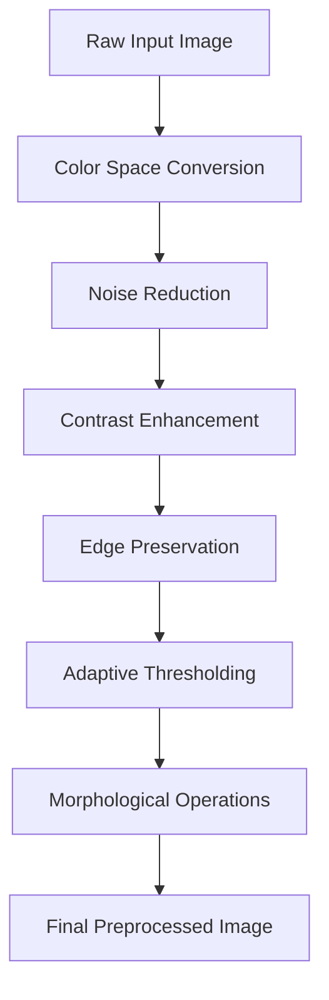

# ANPR Series Part 1: Advanced Image Preprocessing Techniques

Welcome to the first part of our comprehensive **Automatic Number Plate Recognition (ANPR)** series! In this article, we'll dive deep into the critical foundation of any successful ANPR system: **image preprocessing**.

> **Series Navigation:**
> - **Part 1: Image Preprocessing Module** ← *You are here*
> - [Part 2: Plate Detection Engine](/articles/anpr-part-2-plate-detection)
> - [Part 3: Character Segmentation System](/articles/anpr-part-3-character-segmentation)
> - [Part 4: OCR Recognition Module](/articles/anpr-part-4-ocr-recognition)
> - [Part 5: Post-processing & Validation](/articles/anpr-part-5-post-processing)

## Why Image Preprocessing Matters

Image preprocessing is the **cornerstone** of any successful ANPR system. Raw images from cameras often suffer from:

- **Varying lighting conditions** - From harsh sunlight to dim artificial lighting
- **Noise and artifacts** - Sensor noise, compression artifacts, and environmental interference  
- **Poor contrast** - Low dynamic range affecting character visibility
- **Geometric distortions** - Camera angles, lens distortion, and perspective issues
- **Weather conditions** - Rain, fog, or dirt affecting image clarity

Without proper preprocessing, even the most sophisticated machine learning models will struggle to achieve reliable recognition rates.

## 🛠️ Technology Stack for Preprocessing

### Core Libraries
- **OpenCV 4.5+** - Primary computer vision library for image operations
- **NumPy** - High-performance numerical computations and array operations
- **PIL/Pillow** - Additional image manipulation capabilities
- **scikit-image** - Advanced image processing algorithms

### Installation and Setup

```bash
# Install required packages
pip install opencv-python numpy pillow scikit-image matplotlib

# For GPU acceleration (optional)
pip install opencv-contrib-python
```

```python
# Essential imports for preprocessing
import cv2
import numpy as np
from typing import Tuple, Optional, List
import matplotlib.pyplot as plt
from skimage import exposure, filters
import logging

# Configure logging for debugging
logging.basicConfig(level=logging.INFO)
logger = logging.getLogger(__name__)
```

## 📐 Core Preprocessing Pipeline

The preprocessing pipeline transforms raw camera input into optimized images ready for plate detection. Here's our comprehensive approach:

### Pipeline Overview



### Complete Preprocessing Implementation

```python
class ImagePreprocessor:
    """Advanced image preprocessing for ANPR systems."""
    
    def __init__(self, debug: bool = False):
        self.debug = debug
        self.processing_stats = {
            'total_processed': 0,
            'average_processing_time': 0,
            'enhancement_applied': 0
        }
    
    def preprocess_image(self, image: np.ndarray, 
                        enhancement_level: str = 'medium') -> np.ndarray:
        """
        Complete preprocessing pipeline for ANPR optimization.
        
        Args:
            image: Input BGR image from camera
            enhancement_level: 'light', 'medium', 'aggressive'
            
        Returns:
            Preprocessed binary image optimized for plate detection
        """
        import time
        start_time = time.time()
        
        if self.debug:
            logger.info(f"Processing image: {image.shape}")
            self._save_debug_image(image, "01_original")
        
        # Step 1: Convert to grayscale for processing efficiency
        gray = self._convert_to_grayscale(image)
        
        # Step 2: Apply noise reduction while preserving edges
        denoised = self._apply_noise_reduction(gray, enhancement_level)
        
        # Step 3: Enhance contrast using adaptive methods
        enhanced = self._enhance_contrast(denoised, enhancement_level)
        
        # Step 4: Apply appropriate blurring for edge detection
        blurred = self._apply_smart_blur(enhanced)
        
        # Step 5: Generate binary image with adaptive thresholding
        binary = self._adaptive_threshold(blurred)
        
        # Step 6: Clean up with morphological operations
        cleaned = self._morphological_cleanup(binary)
        
        # Update statistics
        processing_time = time.time() - start_time
        self._update_processing_stats(processing_time, enhancement_level)
        
        if self.debug:
            self._save_debug_image(cleaned, "07_final_result")
            logger.info(f"Preprocessing completed in {processing_time:.3f}s")
        
        return cleaned
    
    def _convert_to_grayscale(self, image: np.ndarray) -> np.ndarray:
        """Convert BGR image to optimized grayscale."""
        if len(image.shape) == 3:
            # Use weighted conversion for better contrast
            gray = cv2.cvtColor(image, cv2.COLOR_BGR2GRAY)
        else:
            gray = image.copy()
        
        if self.debug:
            self._save_debug_image(gray, "02_grayscale")
        
        return gray
    
    def _apply_noise_reduction(self, image: np.ndarray, 
                             level: str) -> np.ndarray:
        """Apply intelligent noise reduction based on enhancement level."""
        
        if level == 'light':
            # Gentle Gaussian blur
            denoised = cv2.GaussianBlur(image, (3, 3), 0)
        
        elif level == 'medium':
            # Bilateral filter - preserves edges while reducing noise
            denoised = cv2.bilateralFilter(image, 9, 75, 75)
        
        elif level == 'aggressive':
            # Multi-stage noise reduction
            # First pass: bilateral filter
            stage1 = cv2.bilateralFilter(image, 11, 80, 80)
            # Second pass: non-local means denoising
            denoised = cv2.fastNlMeansDenoising(stage1, None, 10, 7, 21)
        
        else:
            raise ValueError(f"Unknown enhancement level: {level}")
        
        if self.debug:
            self._save_debug_image(denoised, f"03_denoised_{level}")
        
        return denoised
    
    def _enhance_contrast(self, image: np.ndarray, level: str) -> np.ndarray:
        """Apply adaptive contrast enhancement."""
        
        if level == 'light':
            # Simple histogram equalization
            enhanced = cv2.equalizeHist(image)
        
        elif level == 'medium':
            # CLAHE (Contrast Limited Adaptive Histogram Equalization)
            clahe = cv2.createCLAHE(clipLimit=2.0, tileGridSize=(8, 8))
            enhanced = clahe.apply(image)
        
        elif level == 'aggressive':
            # Advanced CLAHE with larger tiles and higher clip limit
            clahe = cv2.createCLAHE(clipLimit=3.0, tileGridSize=(12, 12))
            stage1 = clahe.apply(image)
            
            # Additional gamma correction for extreme cases
            gamma = self._estimate_optimal_gamma(stage1)
            enhanced = self._apply_gamma_correction(stage1, gamma)
        
        if self.debug:
            self._save_debug_image(enhanced, f"04_enhanced_{level}")
        
        return enhanced
    
    def _apply_smart_blur(self, image: np.ndarray) -> np.ndarray:
        """Apply intelligent blurring based on image characteristics."""
        
        # Analyze image sharpness to determine optimal blur kernel
        laplacian_var = cv2.Laplacian(image, cv2.CV_64F).var()
        
        if laplacian_var > 500:  # Sharp image
            kernel_size = (3, 3)
        elif laplacian_var > 100:  # Medium sharpness
            kernel_size = (5, 5)
        else:  # Blurry image - minimal additional blur
            kernel_size = (3, 3)
        
        blurred = cv2.GaussianBlur(image, kernel_size, 0)
        
        if self.debug:
            self._save_debug_image(blurred, f"05_blurred_k{kernel_size[0]}")
            logger.info(f"Image sharpness (Laplacian variance): {laplacian_var:.2f}")
        
        return blurred
    
    def _adaptive_threshold(self, image: np.ndarray) -> np.ndarray:
        """Apply adaptive thresholding for varying lighting conditions."""
        
        # Primary adaptive threshold
        thresh1 = cv2.adaptiveThreshold(
            image, 255,
            cv2.ADAPTIVE_THRESH_GAUSSIAN_C,
            cv2.THRESH_BINARY, 11, 2
        )
        
        # Secondary threshold with different parameters
        thresh2 = cv2.adaptiveThreshold(
            image, 255,
            cv2.ADAPTIVE_THRESH_MEAN_C,
            cv2.THRESH_BINARY, 15, 3
        )
        
        # Combine both thresholds using bitwise operations
        combined = cv2.bitwise_and(thresh1, thresh2)
        
        if self.debug:
            self._save_debug_image(thresh1, "06a_adaptive_gaussian")
            self._save_debug_image(thresh2, "06b_adaptive_mean") 
            self._save_debug_image(combined, "06c_adaptive_combined")
        
        return combined
    
    def _morphological_cleanup(self, image: np.ndarray) -> np.ndarray:
        """Clean up binary image using morphological operations."""
        
        # Define structural elements
        rect_kernel = cv2.getStructuringElement(cv2.MORPH_RECT, (3, 3))
        ellipse_kernel = cv2.getStructuringElement(cv2.MORPH_ELLIPSE, (5, 5))
        
        # Remove small noise with opening
        opened = cv2.morphologyEx(image, cv2.MORPH_OPEN, rect_kernel)
        
        # Fill small gaps with closing
        closed = cv2.morphologyEx(opened, cv2.MORPH_CLOSE, ellipse_kernel)
        
        # Final cleanup with gradient operation to enhance edges
        gradient = cv2.morphologyEx(closed, cv2.MORPH_GRADIENT, rect_kernel)
        
        # Combine original with gradient for enhanced result
        cleaned = cv2.bitwise_or(closed, gradient)
        
        if self.debug:
            self._save_debug_image(opened, "07a_morphology_opened")
            self._save_debug_image(closed, "07b_morphology_closed")
            self._save_debug_image(gradient, "07c_morphology_gradient")
        
        return cleaned
    
    def _estimate_optimal_gamma(self, image: np.ndarray) -> float:
        """Estimate optimal gamma correction value based on image histogram."""
        hist = cv2.calcHist([image], [0], None, [256], [0, 256])
        
        # Calculate mean brightness
        mean_brightness = np.mean(image)
        
        # Estimate gamma based on brightness distribution
        if mean_brightness < 80:      # Dark image
            gamma = 1.5
        elif mean_brightness < 120:   # Medium brightness  
            gamma = 1.2
        elif mean_brightness < 180:   # Bright image
            gamma = 0.8
        else:                         # Very bright image
            gamma = 0.6
        
        if self.debug:
            logger.info(f"Mean brightness: {mean_brightness:.1f}, Estimated gamma: {gamma}")
        
        return gamma
    
    def _apply_gamma_correction(self, image: np.ndarray, gamma: float) -> np.ndarray:
        """Apply gamma correction to adjust image brightness."""
        # Build lookup table
        inv_gamma = 1.0 / gamma
        table = np.array([((i / 255.0) ** inv_gamma) * 255 
                         for i in np.arange(0, 256)]).astype("uint8")
        
        # Apply gamma correction using lookup table
        corrected = cv2.LUT(image, table)
        return corrected
    
    def _update_processing_stats(self, processing_time: float, level: str):
        """Update internal processing statistics."""
        self.processing_stats['total_processed'] += 1
        
        # Update running average of processing time
        total = self.processing_stats['total_processed']
        current_avg = self.processing_stats['average_processing_time']
        new_avg = (current_avg * (total - 1) + processing_time) / total
        self.processing_stats['average_processing_time'] = new_avg
        
        if level in ['medium', 'aggressive']:
            self.processing_stats['enhancement_applied'] += 1
    
    def _save_debug_image(self, image: np.ndarray, filename: str):
        """Save intermediate processing results for debugging."""
        if self.debug:
            debug_path = f"debug_preprocessing_{filename}.jpg"
            cv2.imwrite(debug_path, image)
    
    def get_processing_stats(self) -> dict:
        """Get current processing statistics."""
        return self.processing_stats.copy()

# Convenience function for quick preprocessing
def preprocess_for_anpr(image: np.ndarray, 
                       enhancement: str = 'medium',
                       debug: bool = False) -> np.ndarray:
    """
    Quick preprocessing function for ANPR applications.
    
    Args:
        image: Input BGR image
        enhancement: Enhancement level ('light', 'medium', 'aggressive')
        debug: Whether to save intermediate results
        
    Returns:
        Preprocessed binary image ready for plate detection
    """
    preprocessor = ImagePreprocessor(debug=debug)
    return preprocessor.preprocess_image(image, enhancement)
```

## 🔍 Advanced Preprocessing Techniques

### Handling Extreme Lighting Conditions

```python
class LightingNormalizer:
    """Specialized class for handling challenging lighting scenarios."""
    
    def __init__(self):
        self.illumination_cache = {}
    
    def normalize_illumination(self, image: np.ndarray) -> np.ndarray:
        """
        Advanced illumination normalization for extreme lighting conditions.
        """
        # Estimate background illumination using morphological operations
        kernel_size = max(20, min(image.shape) // 10)
        kernel = cv2.getStructuringElement(cv2.MORPH_ELLIPSE, 
                                         (kernel_size, kernel_size))
        
        # Estimate illumination pattern
        illumination = cv2.morphologyEx(image, cv2.MORPH_CLOSE, kernel)
        
        # Apply Gaussian blur to smooth illumination estimate
        illumination = cv2.GaussianBlur(illumination, (21, 21), 0)
        
        # Normalize using division
        normalized = cv2.divide(image, illumination, scale=255)
        
        return normalized
    
    def handle_backlighting(self, image: np.ndarray) -> np.ndarray:
        """Handle severe backlighting conditions."""
        
        # Detect if image has backlighting issues
        mean_brightness = np.mean(image)
        std_brightness = np.std(image)
        
        if mean_brightness > 180 and std_brightness > 60:
            # Apply specialized processing for backlit images
            
            # Step 1: Reduce highlights
            highlights_mask = image > 200
            reduced = image.copy()
            reduced[highlights_mask] = reduced[highlights_mask] * 0.7
            
            # Step 2: Enhance shadows
            shadows_mask = image < 80
            reduced[shadows_mask] = reduced[shadows_mask] * 1.3
            
            # Step 3: Apply CLAHE with aggressive settings
            clahe = cv2.createCLAHE(clipLimit=4.0, tileGridSize=(6, 6))
            enhanced = clahe.apply(reduced.astype(np.uint8))
            
            return enhanced
        
        return image

# Usage example
def preprocess_challenging_image(image_path: str) -> np.ndarray:
    """Example of preprocessing a challenging image."""
    
    # Load image
    image = cv2.imread(image_path)
    if image is None:
        raise ValueError(f"Could not load image: {image_path}")
    
    # Initialize processors
    preprocessor = ImagePreprocessor(debug=True)
    lighting_normalizer = LightingNormalizer()
    
    # Step 1: Handle extreme lighting
    normalized = lighting_normalizer.normalize_illumination(
        cv2.cvtColor(image, cv2.COLOR_BGR2GRAY)
    )
    
    # Step 2: Handle backlighting if detected
    backlight_corrected = lighting_normalizer.handle_backlighting(normalized)
    
    # Step 3: Apply standard preprocessing pipeline
    # Convert back to BGR for consistency
    bgr_image = cv2.cvtColor(backlight_corrected, cv2.COLOR_GRAY2BGR)
    result = preprocessor.preprocess_image(bgr_image, 'aggressive')
    
    return result
```

## 📊 Performance Analysis and Benchmarking

### Preprocessing Performance Metrics

```python
import time
from typing import Dict, List

class PreprocessingBenchmark:
    """Comprehensive benchmarking for preprocessing performance."""
    
    def __init__(self):
        self.results = {
            'light': [],
            'medium': [],
            'aggressive': []
        }
    
    def benchmark_enhancement_levels(self, test_images: List[np.ndarray],
                                   iterations: int = 5) -> Dict:
        """Benchmark different enhancement levels."""
        
        preprocessor = ImagePreprocessor(debug=False)
        
        for level in ['light', 'medium', 'aggressive']:
            level_times = []
            
            for _ in range(iterations):
                for image in test_images:
                    start_time = time.time()
                    _ = preprocessor.preprocess_image(image, level)
                    processing_time = time.time() - start_time
                    level_times.append(processing_time)
            
            self.results[level] = level_times
        
        return self._calculate_statistics()
    
    def _calculate_statistics(self) -> Dict:
        """Calculate performance statistics."""
        stats = {}
        
        for level, times in self.results.items():
            if times:
                stats[level] = {
                    'mean': np.mean(times),
                    'median': np.median(times),
                    'std': np.std(times),
                    'min': np.min(times),
                    'max': np.max(times),
                    'samples': len(times)
                }
        
        return stats
    
    def generate_performance_report(self) -> str:
        """Generate a formatted performance report."""
        stats = self._calculate_statistics()
        
        report = "\n=== PREPROCESSING PERFORMANCE REPORT ===\n\n"
        
        for level, metrics in stats.items():
            report += f"{level.upper()} Enhancement Level:\n"
            report += f"  Average Time: {metrics['mean']:.3f}s\n"
            report += f"  Median Time:  {metrics['median']:.3f}s\n"
            report += f"  Std Dev:      {metrics['std']:.3f}s\n"
            report += f"  Range:        {metrics['min']:.3f}s - {metrics['max']:.3f}s\n"
            report += f"  Samples:      {metrics['samples']}\n\n"
        
        return report

# Example benchmark usage
def run_preprocessing_benchmark():
    """Run comprehensive preprocessing benchmark."""
    
    # Generate synthetic test images
    test_images = []
    for size in [(640, 480), (1280, 720), (1920, 1080)]:
        # Create test image with realistic characteristics
        img = np.random.randint(0, 255, (size[1], size[0], 3), dtype=np.uint8)
        test_images.append(img)
    
    # Run benchmark
    benchmark = PreprocessingBenchmark()
    results = benchmark.benchmark_enhancement_levels(test_images, iterations=3)
    
    # Display results
    print(benchmark.generate_performance_report())
    
    return results
```

## 🎯 Best Practices and Optimization Tips

### Memory Management

```python
class MemoryOptimizedPreprocessor(ImagePreprocessor):
    """Memory-optimized version of the preprocessor."""
    
    def preprocess_image(self, image: np.ndarray, 
                        enhancement_level: str = 'medium') -> np.ndarray:
        """Memory-efficient preprocessing with in-place operations."""
        
        # Use in-place operations where possible to reduce memory allocation
        if len(image.shape) == 3:
            gray = cv2.cvtColor(image, cv2.COLOR_BGR2GRAY)
        else:
            gray = image  # Don't copy if already grayscale
        
        # In-place noise reduction
        if enhancement_level == 'light':
            cv2.GaussianBlur(gray, (3, 3), 0, dst=gray)
        else:
            gray = cv2.bilateralFilter(gray, 9, 75, 75)
        
        # In-place contrast enhancement
        clahe = cv2.createCLAHE(clipLimit=2.0, tileGridSize=(8, 8))
        clahe.apply(gray, dst=gray)
        
        # Remaining operations...
        binary = cv2.adaptiveThreshold(
            gray, 255, cv2.ADAPTIVE_THRESH_GAUSSIAN_C, cv2.THRESH_BINARY, 11, 2
        )
        
        # In-place morphological operations
        kernel = cv2.getStructuringElement(cv2.MORPH_RECT, (3, 3))
        cv2.morphologyEx(binary, cv2.MORPH_CLOSE, kernel, dst=binary)
        
        return binary
```

### Parameter Tuning Guidelines

```python
class ParameterOptimizer:
    """Automated parameter optimization for preprocessing pipeline."""
    
    def __init__(self):
        self.parameter_ranges = {
            'bilateral_d': range(5, 15, 2),
            'bilateral_sigma_color': range(50, 100, 10),
            'bilateral_sigma_space': range(50, 100, 10),
            'clahe_clip_limit': [1.0, 2.0, 3.0, 4.0],
            'clahe_tile_size': [(4, 4), (8, 8), (12, 12), (16, 16)],
            'adaptive_block_size': range(9, 21, 2),
            'adaptive_c': range(1, 6)
        }
    
    def optimize_parameters(self, sample_images: List[np.ndarray],
                          ground_truth_plates: List[np.ndarray]) -> Dict:
        """
        Optimize preprocessing parameters using sample images.
        """
        best_score = 0
        best_params = {}
        
        # This is a simplified version - in practice, you'd use 
        # more sophisticated optimization like grid search or Bayesian optimization
        
        for clip_limit in self.parameter_ranges['clahe_clip_limit']:
            for tile_size in self.parameter_ranges['clahe_tile_size']:
                for block_size in self.parameter_ranges['adaptive_block_size']:
                    for c in self.parameter_ranges['adaptive_c']:
                        
                        params = {
                            'clahe_clip_limit': clip_limit,
                            'clahe_tile_size': tile_size,
                            'adaptive_block_size': block_size,
                            'adaptive_c': c
                        }
                        
                        score = self._evaluate_parameters(
                            params, sample_images, ground_truth_plates
                        )
                        
                        if score > best_score:
                            best_score = score
                            best_params = params.copy()
        
        return best_params, best_score
    
    def _evaluate_parameters(self, params: Dict, 
                           images: List[np.ndarray],
                           ground_truths: List[np.ndarray]) -> float:
        """Evaluate parameter set using sample images."""
        # Implementation would involve:
        # 1. Apply preprocessing with given parameters
        # 2. Run plate detection on preprocessed images  
        # 3. Compare results with ground truth
        # 4. Return quality score (0-1)
        
        # Placeholder implementation
        return np.random.random()  # Replace with actual evaluation
```

## 🔮 Next Steps

You've now mastered the foundation of ANPR systems! The preprocessing module sets the stage for accurate plate detection and recognition. In the next article, we'll build upon this preprocessed image data to implement the **Plate Detection Engine**.

### Coming Up in Part 2: Plate Detection Engine

- Advanced contour detection and filtering techniques
- Machine learning-based plate localization
- Geometric validation and candidate ranking
- Performance optimization for real-time detection

### Key Takeaways from This Article

✅ **Robust Preprocessing Pipeline** - Handle diverse lighting and image conditions  
✅ **Performance Optimization** - Memory-efficient processing with configurable enhancement levels  
✅ **Debug and Monitoring** - Comprehensive logging and intermediate result visualization  
✅ **Parameter Tuning** - Guidelines for optimizing preprocessing parameters  
✅ **Production Ready** - Error handling and performance monitoring capabilities  

---

### 🔗 Continue the ANPR Journey

Ready for the next challenge? Continue with **[Part 2: Plate Detection Engine](/articles/anpr-part-2-plate-detection)** where we'll use these preprocessed images to accurately locate license plates in the scene.

---

*Questions about image preprocessing techniques or computer vision fundamentals? I'd love to discuss the technical details! Feel free to reach out through my [contact page](/contact) or connect with me on professional networks.*
