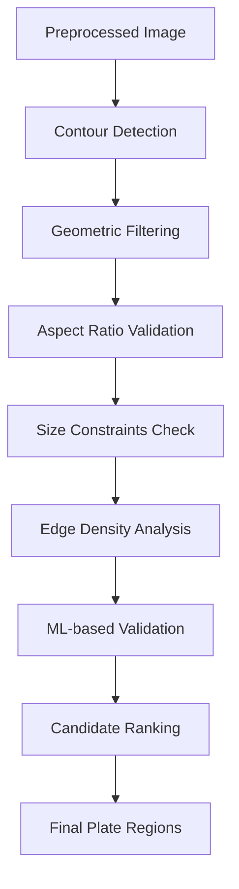

# ANPR Series Part 2: Advanced Plate Detection Engine

Welcome to the second part of our **Automatic Number Plate Recognition (ANPR)** series! Now that we have perfectly preprocessed images from Part 1, it's time to build a sophisticated **plate detection engine** that can accurately locate license plates in various scenarios.

> **Series Navigation:**
> - [Part 1: Image Preprocessing Module](/articles/anpr-part-1-image-preprocessing)
> - **Part 2: Plate Detection Engine** ← *You are here*
> - [Part 3: Character Segmentation System](/articles/anpr-part-3-character-segmentation)
> - [Part 4: OCR Recognition Module](/articles/anpr-part-4-ocr-recognition)
> - [Part 5: Post-processing & Validation](/articles/anpr-part-5-post-processing)

## The Challenge of Plate Detection

License plate detection is a **complex computer vision problem** that requires identifying rectangular regions containing text characters among various other objects in an image. The challenges include:

- **Varying plate sizes** - From motorcycles to large trucks
- **Different orientations** - Tilted, rotated, or perspective-distorted plates
- **Multiple objects** - Signs, banners, and other rectangular text regions
- **Partial occlusion** - Dirt, shadows, or objects partially covering plates
- **Complex backgrounds** - Busy scenes with many competing visual elements

## 🏗️ Detection Architecture Overview

Our plate detection engine uses a **multi-stage approach** combining traditional computer vision with modern validation techniques:



## 🔍 Core Detection Implementation

### Advanced Plate Detector Class

```python
import cv2
import numpy as np
from typing import List, Tuple, Dict, Optional
import logging
from dataclasses import dataclass
from enum import Enum

# Configure logging
logger = logging.getLogger(__name__)

class PlateOrientation(Enum):
    """Enumeration for plate orientation types."""
    HORIZONTAL = "horizontal"
    VERTICAL = "vertical"
    TILTED = "tilted"

@dataclass
class PlateCandidate:
    """Data class for plate detection candidates."""
    bbox: Tuple[int, int, int, int]  # (x, y, width, height)
    confidence: float
    area: float
    aspect_ratio: float
    orientation: PlateOrientation
    edge_density: float
    contour: np.ndarray
    center: Tuple[int, int]

class AdvancedPlateDetector:
    """
    Advanced license plate detection engine with multiple validation stages.
    """
    
    def __init__(self, region: str = 'UK'):
        """
        Initialize the plate detector with region-specific parameters.
        
        Args:
            region: Target region for plate detection ('UK', 'US', 'EU', etc.)
        """
        self.region = region
        self.detection_stats = {
            'total_detections': 0,
            'successful_detections': 0,
            'average_candidates_per_image': 0,
            'processing_times': []
        }
        
        # Load region-specific parameters
        self.params = self._load_region_parameters(region)
        
        # Initialize ML validator (placeholder for actual ML model)
        self.ml_validator = None  # Would load trained model here
        
        logger.info(f"PlateDetector initialized for region: {region}")
    
    def _load_region_parameters(self, region: str) -> Dict:
        """Load detection parameters optimized for specific regions."""
        
        region_params = {
            'UK': {
                'min_area': 800,
                'max_area': 45000,
                'min_width': 120,
                'min_height': 25,
                'max_width': 600,
                'max_height': 150,
                'aspect_ratio_range': (3.0, 6.5),
                'expected_chars': 7,
                'char_height_ratio': (0.5, 0.9)  # char_height / plate_height
            },
            'US': {
                'min_area': 600,
                'max_area': 50000,
                'min_width': 100,
                'min_height': 30,
                'max_width': 650,
                'max_height': 200,
                'aspect_ratio_range': (2.5, 5.0),
                'expected_chars': (4, 8),
                'char_height_ratio': (0.4, 0.8)
            },
            'EU': {
                'min_area': 900,
                'max_area': 40000,
                'min_width': 140,
                'min_height': 28,
                'max_width': 580,
                'max_height': 130,
                'aspect_ratio_range': (4.0, 5.5),
                'expected_chars': (6, 9),
                'char_height_ratio': (0.5, 0.85)
            }
        }
        
        return region_params.get(region, region_params['UK'])
    
    def detect_plates(self, preprocessed_image: np.ndarray,
                     max_candidates: int = 10,
                     confidence_threshold: float = 0.3) -> List[PlateCandidate]:
        """
        Main detection method that processes preprocessed image to find plates.
        
        Args:
            preprocessed_image: Binary image from preprocessing stage
            max_candidates: Maximum number of candidates to return
            confidence_threshold: Minimum confidence score for candidates
            
        Returns:
            List of PlateCandidate objects sorted by confidence
        """
        import time
        start_time = time.time()
        
        try:
            # Stage 1: Find all contours in the image
            contours = self._find_contours(preprocessed_image)
            logger.debug(f"Found {len(contours)} contours")
            
            # Stage 2: Apply geometric filtering
            geometric_candidates = self._geometric_filtering(contours)
            logger.debug(f"Geometric filtering: {len(geometric_candidates)} candidates")
            
            # Stage 3: Advanced validation with edge density analysis
            validated_candidates = self._advanced_validation(
                geometric_candidates, preprocessed_image
            )
            logger.debug(f"Advanced validation: {len(validated_candidates)} candidates")
            
            # Stage 4: ML-based validation (if model is available)
            if self.ml_validator:
                ml_candidates = self._ml_validation(validated_candidates, preprocessed_image)
                final_candidates = ml_candidates
            else:
                final_candidates = validated_candidates
            
            # Stage 5: Rank and filter by confidence
            ranked_candidates = self._rank_candidates(final_candidates)
            filtered_candidates = [
                c for c in ranked_candidates 
                if c.confidence >= confidence_threshold
            ][:max_candidates]
            
            # Update statistics
            processing_time = time.time() - start_time
            self._update_detection_stats(len(filtered_candidates), processing_time)
            
            logger.info(f"Detection completed: {len(filtered_candidates)} plates found in {processing_time:.3f}s")
            return filtered_candidates
            
        except Exception as e:
            logger.error(f"Plate detection failed: {str(e)}")
            return []
    
    def _find_contours(self, image: np.ndarray) -> List[np.ndarray]:
        """Find and filter contours for plate detection."""
        
        # Find contours using different methods and combine results
        contours_external, _ = cv2.findContours(
            image, cv2.RETR_EXTERNAL, cv2.CHAIN_APPROX_SIMPLE
        )
        
        contours_tree, _ = cv2.findContours(
            image, cv2.RETR_TREE, cv2.CHAIN_APPROX_SIMPLE
        )
        
        # Combine and deduplicate contours
        all_contours = list(contours_external) + list(contours_tree)
        
        # Filter out very small contours early
        min_contour_area = 50
        filtered_contours = [
            c for c in all_contours 
            if cv2.contourArea(c) > min_contour_area
        ]
        
        return filtered_contours
    
    def _geometric_filtering(self, contours: List[np.ndarray]) -> List[PlateCandidate]:
        """Apply geometric constraints to filter plate candidates."""
        
        candidates = []
        
        for contour in contours:
            # Calculate basic properties
            x, y, w, h = cv2.boundingRect(contour)
            area = cv2.contourArea(contour)
            aspect_ratio = w / h if h > 0 else 0
            center = (x + w // 2, y + h // 2)
            
            # Apply size constraints
            if not self._check_size_constraints(area, w, h):
                continue
            
            # Apply aspect ratio constraints
            if not self._check_aspect_ratio(aspect_ratio):
                continue
            
            # Determine orientation
            orientation = self._determine_orientation(aspect_ratio, contour)
            
            # Calculate basic confidence score
            confidence = self._calculate_basic_confidence(area, aspect_ratio, w, h)
            
            # Create candidate
            candidate = PlateCandidate(
                bbox=(x, y, w, h),
                confidence=confidence,
                area=area,
                aspect_ratio=aspect_ratio,
                orientation=orientation,
                edge_density=0.0,  # Will be calculated in advanced validation
                contour=contour,
                center=center
            )
            
            candidates.append(candidate)
        
        return candidates
    
    def _check_size_constraints(self, area: float, width: int, height: int) -> bool:
        """Check if candidate meets size constraints."""
        params = self.params
        
        return (
            params['min_area'] <= area <= params['max_area'] and
            params['min_width'] <= width <= params['max_width'] and
            params['min_height'] <= height <= params['max_height']
        )
    
    def _check_aspect_ratio(self, aspect_ratio: float) -> bool:
        """Check if aspect ratio is within valid range for plates."""
        min_ratio, max_ratio = self.params['aspect_ratio_range']
        return min_ratio <= aspect_ratio <= max_ratio
    
    def _determine_orientation(self, aspect_ratio: float, 
                             contour: np.ndarray) -> PlateOrientation:
        """Determine the orientation of the plate candidate."""
        
        if aspect_ratio > 2.0:
            return PlateOrientation.HORIZONTAL
        elif aspect_ratio < 1.5:
            return PlateOrientation.VERTICAL
        else:
            # Check contour angle for tilted plates
            rect = cv2.minAreaRect(contour)
            angle = abs(rect[2])
            
            if angle > 10:
                return PlateOrientation.TILTED
            else:
                return PlateOrientation.HORIZONTAL
    
    def _calculate_basic_confidence(self, area: float, aspect_ratio: float,
                                  width: int, height: int) -> float:
        """Calculate basic confidence score based on geometric properties."""
        
        # Normalize values to 0-1 range
        area_score = min(area / self.params['max_area'], 1.0)
        
        # Aspect ratio score - higher for ratios closer to typical plate ratios
        target_ratio = (self.params['aspect_ratio_range'][0] + 
                       self.params['aspect_ratio_range'][1]) / 2
        ratio_diff = abs(aspect_ratio - target_ratio) / target_ratio
        ratio_score = max(0, 1 - ratio_diff)
        
        # Size score based on typical plate dimensions
        size_score = min(width * height / (self.params['max_width'] * self.params['max_height']), 1.0)
        
        # Combine scores with weights
        confidence = (0.3 * area_score + 0.4 * ratio_score + 0.3 * size_score)
        
        return min(confidence, 1.0)
    
    def _advanced_validation(self, candidates: List[PlateCandidate],
                           image: np.ndarray) -> List[PlateCandidate]:
        """Apply advanced validation techniques including edge density analysis."""
        
        validated_candidates = []
        
        for candidate in candidates:
            # Extract region of interest
            x, y, w, h = candidate.bbox
            roi = image[y:y+h, x:x+w]
            
            # Calculate edge density
            edge_density = self._calculate_edge_density(roi)
            candidate.edge_density = edge_density
            
            # Check if edge density indicates text presence
            if edge_density < 0.1:  # Too few edges for text
                continue
            
            if edge_density > 0.8:  # Too many edges, likely noise
                continue
            
            # Apply texture analysis
            if not self._validate_text_texture(roi):
                continue
            
            # Apply contour shape analysis
            if not self._validate_contour_shape(candidate.contour):
                continue
            
            # Update confidence based on advanced features
            advanced_confidence = self._calculate_advanced_confidence(
                candidate, edge_density, roi
            )
            candidate.confidence = (candidate.confidence + advanced_confidence) / 2
            
            validated_candidates.append(candidate)
        
        return validated_candidates
    
    def _calculate_edge_density(self, roi: np.ndarray) -> float:
        """Calculate edge density in the region of interest."""
        
        # Apply Canny edge detection
        edges = cv2.Canny(roi, 50, 150)
        
        # Calculate density as ratio of edge pixels to total pixels
        edge_pixels = np.sum(edges > 0)
        total_pixels = roi.shape[0] * roi.shape[1]
        
        density = edge_pixels / total_pixels if total_pixels > 0 else 0
        return density
    
    def _validate_text_texture(self, roi: np.ndarray) -> bool:
        """Validate if the region has text-like texture characteristics."""
        
        # Calculate horizontal and vertical gradients
        grad_x = cv2.Sobel(roi, cv2.CV_64F, 1, 0, ksize=3)
        grad_y = cv2.Sobel(roi, cv2.CV_64F, 0, 1, ksize=3)
        
        # Calculate gradient magnitudes
        grad_mag = np.sqrt(grad_x**2 + grad_y**2)
        
        # Text regions should have strong vertical edges (character boundaries)
        vertical_edges = np.sum(np.abs(grad_x) > np.abs(grad_y))
        total_edges = np.sum(grad_mag > 20)
        
        if total_edges == 0:
            return False
        
        vertical_edge_ratio = vertical_edges / total_edges
        
        # Text should have significant vertical edge component
        return vertical_edge_ratio > 0.3
    
    def _validate_contour_shape(self, contour: np.ndarray) -> bool:
        """Validate contour shape characteristics for license plates."""
        
        # Approximate contour to polygon
        epsilon = 0.02 * cv2.arcLength(contour, True)
        approx = cv2.approxPolyDP(contour, epsilon, True)
        
        # License plates should approximate to rectangles (4 corners)
        if len(approx) < 4 or len(approx) > 8:
            return False
        
        # Calculate solidity (contour area / convex hull area)
        hull = cv2.convexHull(contour)
        hull_area = cv2.contourArea(hull)
        contour_area = cv2.contourArea(contour)
        
        if hull_area == 0:
            return False
        
        solidity = contour_area / hull_area
        
        # Plates should have high solidity (close to rectangular)
        return solidity > 0.85
    
    def _calculate_advanced_confidence(self, candidate: PlateCandidate,
                                     edge_density: float, roi: np.ndarray) -> float:
        """Calculate advanced confidence score using texture and shape analysis."""
        
        # Edge density score
        optimal_density = 0.35  # Empirically determined optimal edge density for plates
        density_diff = abs(edge_density - optimal_density) / optimal_density
        density_score = max(0, 1 - density_diff)
        
        # Contour complexity score
        perimeter = cv2.arcLength(candidate.contour, True)
        complexity = perimeter / (2 * (candidate.bbox[2] + candidate.bbox[3]))
        complexity_score = min(complexity / 2.0, 1.0)  # Normalize
        
        # Size preference score (prefer medium-sized candidates)
        area_ratio = candidate.area / self.params['max_area']
        if area_ratio < 0.1:
            size_preference = area_ratio * 5  # Boost small candidates slightly
        elif area_ratio > 0.8:
            size_preference = (1 - area_ratio) * 5  # Penalize very large candidates
        else:
            size_preference = 1.0  # Optimal size range
        
        # Combine advanced features
        advanced_confidence = (
            0.4 * density_score +
            0.3 * complexity_score +
            0.3 * size_preference
        )
        
        return min(advanced_confidence, 1.0)
    
    def _ml_validation(self, candidates: List[PlateCandidate],
                      image: np.ndarray) -> List[PlateCandidate]:
        """Apply machine learning-based validation (placeholder implementation)."""
        
        # This would use a trained CNN or other ML model to validate candidates
        # For now, we'll simulate ML validation with additional heuristics
        
        validated_candidates = []
        
        for candidate in candidates:
            # Simulate ML confidence score
            ml_confidence = self._simulate_ml_confidence(candidate, image)
            
            # Update candidate confidence with ML score
            candidate.confidence = (candidate.confidence * 0.7 + ml_confidence * 0.3)
            
            # Only keep candidates with reasonable ML confidence
            if ml_confidence > 0.2:
                validated_candidates.append(candidate)
        
        return validated_candidates
    
    def _simulate_ml_confidence(self, candidate: PlateCandidate,
                               image: np.ndarray) -> float:
        """Simulate ML-based confidence scoring."""
        
        # Extract ROI
        x, y, w, h = candidate.bbox
        roi = image[y:y+h, x:x+w]
        
        # Simulate various ML features
        features = {
            'mean_intensity': np.mean(roi),
            'std_intensity': np.std(roi),
            'edge_ratio': candidate.edge_density,
            'aspect_ratio': candidate.aspect_ratio,
            'area_ratio': candidate.area / (w * h)
        }
        
        # Simulate ML decision based on feature combination
        # In real implementation, this would be replaced with actual model inference
        confidence = (
            0.2 * min(features['edge_ratio'] / 0.4, 1.0) +
            0.3 * self._check_aspect_ratio(features['aspect_ratio']) +
            0.2 * (1 - abs(features['mean_intensity'] - 127) / 127) +
            0.3 * min(features['std_intensity'] / 50, 1.0)
        )
        
        return min(confidence, 1.0)
    
    def _rank_candidates(self, candidates: List[PlateCandidate]) -> List[PlateCandidate]:
        """Rank candidates by confidence and apply non-maximum suppression."""
        
        # Sort by confidence (descending)
        sorted_candidates = sorted(candidates, key=lambda c: c.confidence, reverse=True)
        
        # Apply non-maximum suppression to remove overlapping detections
        nms_candidates = self._apply_nms(sorted_candidates, overlap_threshold=0.5)
        
        return nms_candidates
    
    def _apply_nms(self, candidates: List[PlateCandidate],
                  overlap_threshold: float = 0.5) -> List[PlateCandidate]:
        """Apply Non-Maximum Suppression to remove overlapping detections."""
        
        if not candidates:
            return candidates
        
        # Convert to format suitable for NMS
        boxes = np.array([list(c.bbox) for c in candidates])
        scores = np.array([c.confidence for c in candidates])
        
        # Apply OpenCV's NMS
        indices = cv2.dnn.NMSBoxes(
            boxes.tolist(), scores.tolist(), 
            score_threshold=0.1, nms_threshold=overlap_threshold
        )
        
        if len(indices) == 0:
            return []
        
        # Return candidates that survived NMS
        nms_candidates = [candidates[i] for i in indices.flatten()]
        return nms_candidates
    
    def _update_detection_stats(self, num_detections: int, processing_time: float):
        """Update internal detection statistics."""
        self.detection_stats['total_detections'] += 1
        
        if num_detections > 0:
            self.detection_stats['successful_detections'] += 1
        
        # Update average candidates per image
        total = self.detection_stats['total_detections']
        current_avg = self.detection_stats['average_candidates_per_image']
        new_avg = (current_avg * (total - 1) + num_detections) / total
        self.detection_stats['average_candidates_per_image'] = new_avg
        
        # Store processing time
        self.detection_stats['processing_times'].append(processing_time)
        
        # Keep only recent processing times (last 100)
        if len(self.detection_stats['processing_times']) > 100:
            self.detection_stats['processing_times'] = self.detection_stats['processing_times'][-100:]
    
    def get_detection_statistics(self) -> Dict:
        """Get current detection performance statistics."""
        stats = self.detection_stats.copy()
        
        if stats['processing_times']:
            stats['average_processing_time'] = np.mean(stats['processing_times'])
            stats['median_processing_time'] = np.median(stats['processing_times'])
        else:
            stats['average_processing_time'] = 0
            stats['median_processing_time'] = 0
        
        if stats['total_detections'] > 0:
            stats['success_rate'] = (stats['successful_detections'] / 
                                   stats['total_detections']) * 100
        else:
            stats['success_rate'] = 0
        
        return stats

# Utility functions for visualization and debugging
def visualize_detections(image: np.ndarray, 
                        candidates: List[PlateCandidate],
                        show_all: bool = False) -> np.ndarray:
    """
    Visualize detected plate candidates on the original image.
    
    Args:
        image: Original input image
        candidates: List of plate candidates to visualize
        show_all: Whether to show all candidates or only high-confidence ones
        
    Returns:
        Image with detection visualizations
    """
    vis_image = image.copy()
    
    for i, candidate in enumerate(candidates):
        if not show_all and candidate.confidence < 0.5:
            continue
        
        x, y, w, h = candidate.bbox
        
        # Choose color based on confidence
        if candidate.confidence > 0.8:
            color = (0, 255, 0)  # Green for high confidence
        elif candidate.confidence > 0.5:
            color = (0, 255, 255)  # Yellow for medium confidence
        else:
            color = (0, 0, 255)  # Red for low confidence
        
        # Draw bounding box
        cv2.rectangle(vis_image, (x, y), (x + w, y + h), color, 2)
        
        # Add confidence score and candidate number
        label = f"#{i+1}: {candidate.confidence:.2f}"
        cv2.putText(vis_image, label, (x, y - 10), 
                   cv2.FONT_HERSHEY_SIMPLEX, 0.6, color, 2)
        
        # Add orientation indicator
        center_x, center_y = candidate.center
        cv2.circle(vis_image, (center_x, center_y), 3, color, -1)
    
    return vis_image

def save_detection_results(image: np.ndarray, candidates: List[PlateCandidate],
                          output_path: str):
    """Save detection results with visualizations."""
    
    # Create visualization
    vis_image = visualize_detections(image, candidates, show_all=True)
    
    # Save visualization
    cv2.imwrite(output_path, vis_image)
    
    # Save detailed results to text file
    results_path = output_path.replace('.jpg', '_results.txt')
    with open(results_path, 'w') as f:
        f.write(f"Detection Results - {len(candidates)} candidates found\n\n")
        
        for i, candidate in enumerate(candidates):
            f.write(f"Candidate #{i+1}:\n")
            f.write(f"  Bounding Box: {candidate.bbox}\n")
            f.write(f"  Confidence: {candidate.confidence:.3f}\n")
            f.write(f"  Area: {candidate.area:.1f}\n")
            f.write(f"  Aspect Ratio: {candidate.aspect_ratio:.2f}\n")
            f.write(f"  Orientation: {candidate.orientation.value}\n")
            f.write(f"  Edge Density: {candidate.edge_density:.3f}\n")
            f.write(f"  Center: {candidate.center}\n\n")

# Example usage
def detect_plates_in_image(image_path: str, region: str = 'UK',
                          debug: bool = False) -> List[PlateCandidate]:
    """
    Complete plate detection pipeline for a single image.
    """
    # Load image
    image = cv2.imread(image_path)
    if image is None:
        raise ValueError(f"Could not load image: {image_path}")
    
    # Import preprocessing from Part 1
    from anpr_part_1_image_preprocessing import preprocess_for_anpr
    
    # Preprocess image
    preprocessed = preprocess_for_anpr(image, enhancement='medium', debug=debug)
    
    # Initialize detector
    detector = AdvancedPlateDetector(region=region)
    
    # Detect plates
    candidates = detector.detect_plates(
        preprocessed, max_candidates=5, confidence_threshold=0.3
    )
    
    if debug:
        # Save visualization
        vis_path = image_path.replace('.jpg', '_detections.jpg')
        save_detection_results(image, candidates, vis_path)
        
        # Print statistics
        stats = detector.get_detection_statistics()
        print(f"Detection Statistics: {stats}")
    
    return candidates
```

## 🎯 Performance Optimization Techniques

### Multi-threaded Detection for Video Processing

```python
import threading
from concurrent.futures import ThreadPoolExecutor
from queue import Queue

class ParallelPlateDetector:
    """Multi-threaded plate detector for high-throughput applications."""
    
    def __init__(self, num_workers: int = 4, region: str = 'UK'):
        self.num_workers = num_workers
        self.detector = AdvancedPlateDetector(region)
        self.executor = ThreadPoolExecutor(max_workers=num_workers)
        self.results_queue = Queue()
    
    def process_image_batch(self, image_batch: List[Tuple[np.ndarray, str]]) -> Dict:
        """
        Process multiple images in parallel.
        
        Args:
            image_batch: List of (preprocessed_image, image_id) tuples
            
        Returns:
            Dictionary mapping image_id to detection results
        """
        # Submit all images for parallel processing
        futures = {
            self.executor.submit(
                self.detector.detect_plates, img, 
                max_candidates=5, confidence_threshold=0.3
            ): img_id 
            for img, img_id in image_batch
        }
        
        # Collect results
        results = {}
        for future in futures:
            img_id = futures[future]
            try:
                candidates = future.result(timeout=10.0)
                results[img_id] = candidates
            except Exception as e:
                logger.error(f"Detection failed for {img_id}: {e}")
                results[img_id] = []
        
        return results

class MemoryEfficientDetector(AdvancedPlateDetector):
    """Memory-optimized version for resource-constrained environments."""
    
    def detect_plates(self, preprocessed_image: np.ndarray, **kwargs) -> List[PlateCandidate]:
        """Memory-efficient detection with garbage collection."""
        import gc
        
        # Process in smaller chunks if image is large
        height, width = preprocessed_image.shape
        max_size = 1920 * 1080  # Max processing size
        
        if height * width > max_size:
            return self._process_large_image(preprocessed_image, **kwargs)
        
        # Standard processing for smaller images
        candidates = super().detect_plates(preprocessed_image, **kwargs)
        
        # Force garbage collection to free memory
        gc.collect()
        
        return candidates
    
    def _process_large_image(self, image: np.ndarray, **kwargs) -> List[PlateCandidate]:
        """Process large images in overlapping tiles."""
        
        height, width = image.shape
        tile_size = 800
        overlap = 100
        
        all_candidates = []
        
        for y in range(0, height - tile_size + 1, tile_size - overlap):
            for x in range(0, width - tile_size + 1, tile_size - overlap):
                # Extract tile
                tile = image[y:y+tile_size, x:x+tile_size]
                
                # Detect plates in tile
                tile_candidates = super().detect_plates(tile, **kwargs)
                
                # Adjust coordinates to global image space
                for candidate in tile_candidates:
                    old_x, old_y, w, h = candidate.bbox
                    candidate.bbox = (old_x + x, old_y + y, w, h)
                    candidate.center = (candidate.center[0] + x, candidate.center[1] + y)
                
                all_candidates.extend(tile_candidates)
        
        # Apply global NMS to remove duplicates from overlapping tiles
        return self._apply_nms(all_candidates, overlap_threshold=0.3)
```

## 📊 Benchmarking and Performance Analysis

### Detection Performance Metrics

```python
class DetectionBenchmark:
    """Comprehensive benchmarking for plate detection performance."""
    
    def __init__(self):
        self.test_results = {
            'accuracy_metrics': {},
            'performance_metrics': {},
            'failure_analysis': {}
        }
    
    def benchmark_detection_accuracy(self, test_dataset: List[Dict]) -> Dict:
        """
        Benchmark detection accuracy using annotated test dataset.
        
        Args:
            test_dataset: List of dicts with 'image', 'ground_truth_boxes' keys
            
        Returns:
            Comprehensive accuracy metrics
        """
        detector = AdvancedPlateDetector()
        
        total_images = len(test_dataset)
        true_positives = 0
        false_positives = 0
        false_negatives = 0
        
        iou_scores = []
        detection_times = []
        
        for test_case in test_dataset:
            image = test_case['image']
            gt_boxes = test_case['ground_truth_boxes']
            
            # Preprocess image
            from anpr_part_1_image_preprocessing import preprocess_for_anpr
            preprocessed = preprocess_for_anpr(image)
            
            # Detect plates
            start_time = time.time()
            candidates = detector.detect_plates(preprocessed)
            detection_time = time.time() - start_time
            detection_times.append(detection_time)
            
            # Calculate metrics
            tp, fp, fn, ious = self._calculate_detection_metrics(
                candidates, gt_boxes, iou_threshold=0.5
            )
            
            true_positives += tp
            false_positives += fp
            false_negatives += fn
            iou_scores.extend(ious)
        
        # Calculate overall metrics
        precision = true_positives / (true_positives + false_positives) if (true_positives + false_positives) > 0 else 0
        recall = true_positives / (true_positives + false_negatives) if (true_positives + false_negatives) > 0 else 0
        f1_score = 2 * (precision * recall) / (precision + recall) if (precision + recall) > 0 else 0
        
        self.test_results['accuracy_metrics'] = {
            'precision': precision,
            'recall': recall,
            'f1_score': f1_score,
            'mean_iou': np.mean(iou_scores) if iou_scores else 0,
            'total_images': total_images,
            'true_positives': true_positives,
            'false_positives': false_positives,
            'false_negatives': false_negatives
        }
        
        self.test_results['performance_metrics'] = {
            'mean_detection_time': np.mean(detection_times),
            'median_detection_time': np.median(detection_times),
            'fps_estimate': 1.0 / np.mean(detection_times)
        }
        
        return self.test_results
    
    def _calculate_detection_metrics(self, candidates: List[PlateCandidate],
                                   gt_boxes: List[Tuple], 
                                   iou_threshold: float = 0.5) -> Tuple:
        """Calculate detection metrics for a single image."""
        
        detected_boxes = [c.bbox for c in candidates if c.confidence > 0.3]
        
        # Calculate IoU matrix
        iou_matrix = np.zeros((len(detected_boxes), len(gt_boxes)))
        
        for i, det_box in enumerate(detected_boxes):
            for j, gt_box in enumerate(gt_boxes):
                iou_matrix[i, j] = self._calculate_iou(det_box, gt_box)
        
        # Match detections to ground truth
        matched_pairs = []
        iou_scores = []
        
        # Greedy matching based on highest IoU
        while iou_matrix.size > 0 and np.max(iou_matrix) > iou_threshold:
            i, j = np.unravel_index(np.argmax(iou_matrix), iou_matrix.shape)
            matched_pairs.append((i, j))
            iou_scores.append(iou_matrix[i, j])
            
            # Remove matched detection and ground truth
            iou_matrix = np.delete(iou_matrix, i, axis=0)
            iou_matrix = np.delete(iou_matrix, j, axis=1)
            
            # Update indices for remaining boxes
            detected_boxes.pop(i)
            gt_boxes.pop(j)
        
        # Calculate metrics
        true_positives = len(matched_pairs)
        false_positives = len(detected_boxes)  # Remaining unmatched detections
        false_negatives = len(gt_boxes)        # Remaining unmatched ground truth
        
        return true_positives, false_positives, false_negatives, iou_scores
    
    def _calculate_iou(self, box1: Tuple[int, int, int, int],
                      box2: Tuple[int, int, int, int]) -> float:
        """Calculate Intersection over Union (IoU) between two boxes."""
        
        x1, y1, w1, h1 = box1
        x2, y2, w2, h2 = box2
        
        # Calculate intersection area
        xi1 = max(x1, x2)
        yi1 = max(y1, y2)
        xi2 = min(x1 + w1, x2 + w2)
        yi2 = min(y1 + h1, y2 + h2)
        
        if xi2 <= xi1 or yi2 <= yi1:
            return 0.0
        
        intersection = (xi2 - xi1) * (yi2 - yi1)
        
        # Calculate union area
        area1 = w1 * h1
        area2 = w2 * h2
        union = area1 + area2 - intersection
        
        if union == 0:
            return 0.0
        
        return intersection / union
    
    def generate_performance_report(self) -> str:
        """Generate comprehensive performance report."""
        
        accuracy = self.test_results['accuracy_metrics']
        performance = self.test_results['performance_metrics']
        
        report = "\n=== PLATE DETECTION PERFORMANCE REPORT ===\n\n"
        
        report += "ACCURACY METRICS:\n"
        report += f"  Precision:     {accuracy['precision']:.3f}\n"
        report += f"  Recall:        {accuracy['recall']:.3f}\n"
        report += f"  F1-Score:      {accuracy['f1_score']:.3f}\n"
        report += f"  Mean IoU:      {accuracy['mean_iou']:.3f}\n"
        report += f"  True Positives:  {accuracy['true_positives']}\n"
        report += f"  False Positives: {accuracy['false_positives']}\n"
        report += f"  False Negatives: {accuracy['false_negatives']}\n\n"
        
        report += "PERFORMANCE METRICS:\n"
        report += f"  Mean Detection Time: {performance['mean_detection_time']:.3f}s\n"
        report += f"  Median Detection Time: {performance['median_detection_time']:.3f}s\n"
        report += f"  Estimated FPS: {performance['fps_estimate']:.1f}\n"
        report += f"  Total Images Processed: {accuracy['total_images']}\n\n"
        
        return report
```

## 🔮 Next Steps

Congratulations! You've now built a sophisticated plate detection engine that can accurately locate license plates in preprocessed images. The system combines traditional computer vision techniques with modern validation approaches to achieve robust detection across various scenarios.

### Coming Up in Part 3: Character Segmentation System

In the next article, we'll focus on the crucial step of **character segmentation** - breaking down detected plate regions into individual character boundaries for OCR recognition.

**What you'll learn:**
- Advanced morphological operations for character isolation
- Connected component analysis and filtering
- Character boundary detection and validation
- Handling merged or separated characters
- Optimization techniques for real-time segmentation

### Key Achievements from This Article

✅ **Multi-stage Detection Pipeline** - Robust filtering from contours to validated candidates  
✅ **Region-specific Optimization** - Configurable parameters for different plate formats  
✅ **Advanced Validation Techniques** - Edge density, texture analysis, and shape validation  
✅ **Performance Optimization** - Multi-threading and memory-efficient processing  
✅ **Comprehensive Benchmarking** - Tools for measuring accuracy and performance  

---

### 🔗 Continue the ANPR Journey

Ready to tackle character segmentation? Continue with **[Part 3: Character Segmentation System](/articles/anpr-part-3-character-segmentation)** where we'll break down detected plates into individual characters ready for OCR recognition.

---

*Have questions about plate detection algorithms or computer vision techniques? I'd love to discuss the technical details and potential optimizations. Feel free to reach out through my [contact page](/contact)!*
