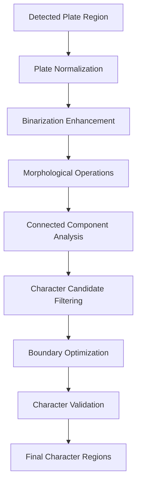

# ANPR Series Part 3: Intelligent Character Segmentation System

Welcome to the third part of our **Automatic Number Plate Recognition (ANPR)** series! With detected license plate regions from Part 2, we now face one of the most challenging aspects of ANPR: **character segmentation** - the process of accurately separating individual characters within a plate region.

> **Series Navigation:**
> - [Part 1: Image Preprocessing Module](/articles/anpr-part-1-image-preprocessing)
> - [Part 2: Plate Detection Engine](/articles/anpr-part-2-plate-detection)
> - **Part 3: Character Segmentation System** ← *You are here*
> - [Part 4: OCR Recognition Module](/articles/anpr-part-4-ocr-recognition)
> - [Part 5: Post-processing & Validation](/articles/anpr-part-5-post-processing)

## The Character Segmentation Challenge

Character segmentation is often the **make-or-break** component of ANPR systems. Unlike printed text with consistent spacing, license plates present unique challenges:

- **Variable character spacing** - Different manufacturers use different kerning
- **Connected characters** - Dirt, wear, or poor printing can merge characters
- **Broken characters** - Weather damage or low resolution can fragment characters
- **Non-uniform lighting** - Shadows can create artificial character boundaries
- **Perspective distortion** - Camera angle affects character shape and spacing
- **Multiple fonts and sizes** - Various plate formats require adaptable segmentation

## 🏗️ Segmentation Architecture Overview

Our character segmentation system uses a **multi-layered approach** combining morphological operations, connected component analysis, and intelligent validation:



## 🔧 Core Segmentation Implementation

### Advanced Character Segmentation Class

```python
import cv2
import numpy as np
from typing import List, Tuple, Dict, Optional
import logging
from dataclasses import dataclass
from enum import Enum
import matplotlib.pyplot as plt

# Configure logging
logger = logging.getLogger(__name__)

class SegmentationMethod(Enum):
    """Enumeration for different segmentation approaches."""
    CONNECTED_COMPONENTS = "connected_components"
    PROJECTION_BASED = "projection_based"
    WATERSHED = "watershed"
    HYBRID = "hybrid"

@dataclass
class CharacterCandidate:
    """Data class for character segmentation candidates."""
    bbox: Tuple[int, int, int, int]  # (x, y, width, height)
    confidence: float
    area: float
    aspect_ratio: float
    center: Tuple[int, int]
    contour: np.ndarray
    character_image: np.ndarray
    position_index: int  # Position in the plate (0-based from left)

class AdvancedCharacterSegmenter:
    """
    Advanced character segmentation system for license plate recognition.
    """
    
    def __init__(self, region: str = 'UK', debug: bool = False):
        """
        Initialize the character segmenter with region-specific parameters.
        
        Args:
            region: Target region for plates ('UK', 'US', 'EU', etc.)
            debug: Enable debug mode for intermediate visualizations
        """
        self.region = region
        self.debug = debug
        self.segmentation_stats = {
            'total_plates_processed': 0,
            'successful_segmentations': 0,
            'average_characters_per_plate': 0,
            'processing_times': []
        }
        
        # Load region-specific parameters
        self.params = self._load_region_parameters(region)
        
        logger.info(f"CharacterSegmenter initialized for region: {region}")
    
    def _load_region_parameters(self, region: str) -> Dict:
        """Load segmentation parameters optimized for specific regions."""
        
        region_params = {
            'UK': {
                'expected_char_count': 7,
                'char_aspect_ratio_range': (0.3, 1.2),
                'min_char_width': 8,
                'max_char_width': 60,
                'min_char_height': 15,
                'max_char_height': 100,
                'char_spacing_range': (2, 20),
                'plate_padding': 0.05  # Percentage of plate width/height
            },
            'US': {
                'expected_char_count': (4, 8),
                'char_aspect_ratio_range': (0.25, 1.5),
                'min_char_width': 6,
                'max_char_width': 80,
                'min_char_height': 20,
                'max_char_height': 120,
                'char_spacing_range': (1, 25),
                'plate_padding': 0.08
            },
            'EU': {
                'expected_char_count': (6, 9),
                'char_aspect_ratio_range': (0.35, 1.1),
                'min_char_width': 10,
                'max_char_width': 55,
                'min_char_height': 18,
                'max_char_height': 90,
                'char_spacing_range': (3, 18),
                'plate_padding': 0.06
            }
        }
        
        return region_params.get(region, region_params['UK'])
    
    def segment_characters(self, plate_image: np.ndarray,
                         method: SegmentationMethod = SegmentationMethod.HYBRID,
                         min_confidence: float = 0.3) -> List[CharacterCandidate]:
        """
        Main segmentation method that processes plate image to extract characters.
        
        Args:
            plate_image: Binary plate region from detection stage
            method: Segmentation method to use
            min_confidence: Minimum confidence threshold for character candidates
            
        Returns:
            List of CharacterCandidate objects sorted by position
        """
        import time
        start_time = time.time()
        
        try:
            # Stage 1: Normalize and enhance the plate region
            normalized_plate = self._normalize_plate_region(plate_image)
            
            if self.debug:
                self._save_debug_image(normalized_plate, "01_normalized_plate")
            
            # Stage 2: Apply method-specific segmentation
            if method == SegmentationMethod.CONNECTED_COMPONENTS:
                candidates = self._connected_component_segmentation(normalized_plate)
            elif method == SegmentationMethod.PROJECTION_BASED:
                candidates = self._projection_based_segmentation(normalized_plate)
            elif method == SegmentationMethod.WATERSHED:
                candidates = self._watershed_segmentation(normalized_plate)
            elif method == SegmentationMethod.HYBRID:
                candidates = self._hybrid_segmentation(normalized_plate)
            else:
                raise ValueError(f"Unknown segmentation method: {method}")
            
            logger.debug(f"Initial segmentation: {len(candidates)} candidates")
            
            # Stage 3: Filter and validate character candidates
            filtered_candidates = self._filter_character_candidates(candidates, normalized_plate)
            logger.debug(f"After filtering: {len(filtered_candidates)} candidates")
            
            # Stage 4: Optimize character boundaries
            optimized_candidates = self._optimize_character_boundaries(
                filtered_candidates, normalized_plate
            )
            
            # Stage 5: Final validation and confidence scoring
            final_candidates = self._validate_and_score_characters(
                optimized_candidates, normalized_plate, min_confidence
            )
            
            # Stage 6: Sort by position (left to right)
            sorted_candidates = sorted(final_candidates, key=lambda c: c.bbox[0])
            
            # Update position indices
            for i, candidate in enumerate(sorted_candidates):
                candidate.position_index = i
            
            # Update statistics
            processing_time = time.time() - start_time
            self._update_segmentation_stats(len(sorted_candidates), processing_time)
            
            logger.info(f"Segmentation completed: {len(sorted_candidates)} characters found in {processing_time:.3f}s")
            
            if self.debug:
                self._visualize_segmentation_results(normalized_plate, sorted_candidates)
            
            return sorted_candidates
            
        except Exception as e:
            logger.error(f"Character segmentation failed: {str(e)}")
            return []
    
    def _normalize_plate_region(self, plate_image: np.ndarray) -> np.ndarray:
        """Normalize and enhance the plate region for optimal segmentation."""
        
        # Ensure we have a binary image
        if len(plate_image.shape) > 2:
            plate_image = cv2.cvtColor(plate_image, cv2.COLOR_BGR2GRAY)
        
        # Apply morphological operations to clean up the image
        kernel_close = cv2.getStructuringElement(cv2.MORPH_RECT, (2, 2))
        cleaned = cv2.morphologyEx(plate_image, cv2.MORPH_CLOSE, kernel_close)
        
        # Remove border noise
        h, w = cleaned.shape
        border_size = max(1, min(h, w) // 20)
        cleaned[:border_size, :] = 0
        cleaned[-border_size:, :] = 0
        cleaned[:, :border_size] = 0
        cleaned[:, -border_size:] = 0
        
        # Apply additional noise reduction
        kernel_open = cv2.getStructuringElement(cv2.MORPH_ELLIPSE, (3, 3))
        cleaned = cv2.morphologyEx(cleaned, cv2.MORPH_OPEN, kernel_open)
        
        # Ensure consistent foreground/background (characters should be white on black background)
        if np.mean(cleaned) > 127:  # More white than black pixels
            cleaned = cv2.bitwise_not(cleaned)
        
        return cleaned
    
    def _connected_component_segmentation(self, plate_image: np.ndarray) -> List[CharacterCandidate]:
        """Segment characters using connected component analysis."""
        
        # Find connected components
        num_labels, labels, stats, centroids = cv2.connectedComponentsWithStats(
            plate_image, connectivity=8
        )
        
        candidates = []
        
        # Process each component (skip background label 0)
        for i in range(1, num_labels):
            x, y, w, h, area = stats[i]
            
            # Apply size constraints
            if not self._check_character_size_constraints(w, h, area):
                continue
            
            # Extract character image
            component_mask = (labels == i).astype(np.uint8) * 255
            char_image = cv2.bitwise_and(plate_image, component_mask)
            char_roi = char_image[y:y+h, x:x+w]
            
            # Calculate properties
            aspect_ratio = w / h if h > 0 else 0
            center = (x + w // 2, y + h // 2)
            
            # Create contour from component
            contours, _ = cv2.findContours(component_mask, cv2.RETR_EXTERNAL, cv2.CHAIN_APPROX_SIMPLE)
            contour = contours[0] if contours else np.array([])
            
            # Calculate confidence based on component properties
            confidence = self._calculate_component_confidence(w, h, area, aspect_ratio)
            
            candidate = CharacterCandidate(
                bbox=(x, y, w, h),
                confidence=confidence,
                area=area,
                aspect_ratio=aspect_ratio,
                center=center,
                contour=contour,
                character_image=char_roi,
                position_index=-1  # Will be set later
            )
            
            candidates.append(candidate)
        
        return candidates
    
    def _projection_based_segmentation(self, plate_image: np.ndarray) -> List[CharacterCandidate]:
        """Segment characters using horizontal projection analysis."""
        
        # Calculate horizontal projection (sum of white pixels in each column)
        h, w = plate_image.shape
        horizontal_projection = np.sum(plate_image, axis=0)
        
        # Smooth the projection to reduce noise
        from scipy import ndimage
        smoothed_projection = ndimage.gaussian_filter1d(horizontal_projection, sigma=1.5)
        
        # Find character boundaries using projection minima
        # Apply threshold to identify gaps between characters
        projection_threshold = np.max(smoothed_projection) * 0.2
        gaps = smoothed_projection < projection_threshold
        
        # Find transitions from gap to character and character to gap
        transitions = np.diff(gaps.astype(int))
        char_starts = np.where(transitions == -1)[0] + 1
        char_ends = np.where(transitions == 1)[0] + 1
        
        # Handle edge cases
        if gaps[0] == False:  # Starts with character
            char_starts = np.insert(char_starts, 0, 0)
        if gaps[-1] == False:  # Ends with character
            char_ends = np.append(char_ends, w)
        
        # Ensure we have matching starts and ends
        min_len = min(len(char_starts), len(char_ends))
        char_starts = char_starts[:min_len]
        char_ends = char_ends[:min_len]
        
        candidates = []
        
        for i, (start, end) in enumerate(zip(char_starts, char_ends)):
            char_width = end - start
            
            if char_width < self.params['min_char_width']:
                continue
            
            # Find vertical boundaries for this character region
            char_region = plate_image[:, start:end]
            vertical_projection = np.sum(char_region, axis=1)
            
            # Find top and bottom boundaries
            non_zero_rows = np.where(vertical_projection > 0)[0]
            if len(non_zero_rows) == 0:
                continue
            
            char_top = non_zero_rows[0]
            char_bottom = non_zero_rows[-1] + 1
            char_height = char_bottom - char_top
            
            # Apply size constraints
            if not self._check_character_size_constraints(char_width, char_height, char_width * char_height):
                continue
            
            # Extract character image
            char_roi = plate_image[char_top:char_bottom, start:end]
            
            # Calculate properties
            aspect_ratio = char_width / char_height if char_height > 0 else 0
            center = (start + char_width // 2, char_top + char_height // 2)
            area = char_width * char_height
            
            # Create contour approximation
            contour = np.array([
                [[start, char_top]], [[end, char_top]],
                [[end, char_bottom]], [[start, char_bottom]]
            ])
            
            # Calculate confidence
            confidence = self._calculate_projection_confidence(
                char_width, char_height, horizontal_projection[start:end]
            )
            
            candidate = CharacterCandidate(
                bbox=(start, char_top, char_width, char_height),
                confidence=confidence,
                area=area,
                aspect_ratio=aspect_ratio,
                center=center,
                contour=contour,
                character_image=char_roi,
                position_index=-1
            )
            
            candidates.append(candidate)
        
        return candidates
    
    def _watershed_segmentation(self, plate_image: np.ndarray) -> List[CharacterCandidate]:
        """Segment characters using watershed algorithm for connected characters."""
        
        # Apply distance transform
        dist_transform = cv2.distanceTransform(plate_image, cv2.DIST_L2, 5)
        
        # Find local maxima as seeds
        local_maxima = self._find_local_maxima(dist_transform, min_distance=10)
        
        # Create markers for watershed
        markers = np.zeros_like(plate_image, dtype=np.int32)
        
        for i, (x, y) in enumerate(local_maxima):
            markers[y, x] = i + 1
        
        # Apply watershed
        # Convert to 3-channel for watershed
        plate_3ch = cv2.cvtColor(plate_image, cv2.COLOR_GRAY2BGR)
        markers = cv2.watershed(plate_3ch, markers)
        
        # Extract character regions from watershed results
        candidates = []
        unique_labels = np.unique(markers)
        
        for label in unique_labels:
            if label <= 0:  # Skip background and boundaries
                continue
            
            # Create mask for this region
            region_mask = (markers == label).astype(np.uint8) * 255
            
            # Find bounding box
            contours, _ = cv2.findContours(region_mask, cv2.RETR_EXTERNAL, cv2.CHAIN_APPROX_SIMPLE)
            if not contours:
                continue
            
            contour = contours[0]
            x, y, w, h = cv2.boundingRect(contour)
            
            # Apply size constraints
            if not self._check_character_size_constraints(w, h, w * h):
                continue
            
            # Extract character image
            char_roi = cv2.bitwise_and(plate_image, region_mask)[y:y+h, x:x+w]
            
            # Calculate properties
            aspect_ratio = w / h if h > 0 else 0
            center = (x + w // 2, y + h // 2)
            area = w * h
            
            # Calculate confidence based on watershed properties
            confidence = self._calculate_watershed_confidence(region_mask, dist_transform[y:y+h, x:x+w])
            
            candidate = CharacterCandidate(
                bbox=(x, y, w, h),
                confidence=confidence,
                area=area,
                aspect_ratio=aspect_ratio,
                center=center,
                contour=contour,
                character_image=char_roi,
                position_index=-1
            )
            
            candidates.append(candidate)
        
        return candidates
    
    def _hybrid_segmentation(self, plate_image: np.ndarray) -> List[CharacterCandidate]:
        """Combine multiple segmentation methods for robust results."""
        
        # Run all segmentation methods
        cc_candidates = self._connected_component_segmentation(plate_image)
        proj_candidates = self._projection_based_segmentation(plate_image)
        ws_candidates = self._watershed_segmentation(plate_image)
        
        # Combine candidates from all methods
        all_candidates = cc_candidates + proj_candidates + ws_candidates
        
        # Remove duplicates using Non-Maximum Suppression
        unique_candidates = self._remove_duplicate_candidates(all_candidates)
        
        # Boost confidence for candidates found by multiple methods
        for candidate in unique_candidates:
            overlap_count = self._count_overlapping_candidates(candidate, all_candidates)
            if overlap_count > 1:
                candidate.confidence = min(candidate.confidence * 1.2, 1.0)
        
        return unique_candidates
    
    def _find_local_maxima(self, distance_map: np.ndarray, min_distance: int = 10) -> List[Tuple[int, int]]:
        """Find local maxima in distance transform for watershed seeds."""
        
        from scipy.ndimage import maximum_filter
        
        # Apply maximum filter
        local_max_map = (distance_map == maximum_filter(distance_map, size=min_distance))
        
        # Find coordinates of local maxima
        maxima_coords = np.column_stack(np.where(local_max_map))
        
        # Convert to (x, y) format and filter by intensity
        min_intensity = np.max(distance_map) * 0.3
        filtered_maxima = []
        
        for y, x in maxima_coords:
            if distance_map[y, x] > min_intensity:
                filtered_maxima.append((x, y))
        
        return filtered_maxima
    
    def _check_character_size_constraints(self, width: int, height: int, area: float) -> bool:
        """Check if character candidate meets size constraints."""
        params = self.params
        
        return (
            params['min_char_width'] <= width <= params['max_char_width'] and
            params['min_char_height'] <= height <= params['max_char_height'] and
            area >= params['min_char_width'] * params['min_char_height']
        )
    
    def _calculate_component_confidence(self, width: int, height: int, 
                                      area: float, aspect_ratio: float) -> float:
        """Calculate confidence score for connected component candidate."""
        
        # Aspect ratio score
        target_ratio = 0.6  # Typical character aspect ratio
        ratio_diff = abs(aspect_ratio - target_ratio) / target_ratio
        ratio_score = max(0, 1 - ratio_diff)
        
        # Size score
        area_score = min(area / (self.params['max_char_width'] * self.params['max_char_height']), 1.0)
        
        # Combine scores
        confidence = 0.6 * ratio_score + 0.4 * area_score
        return min(confidence, 1.0)
    
    def _calculate_projection_confidence(self, width: int, height: int, 
                                       projection: np.ndarray) -> float:
        """Calculate confidence for projection-based candidate."""
        
        # Projection consistency score
        projection_std = np.std(projection)
        projection_mean = np.mean(projection)
        
        if projection_mean == 0:
            consistency_score = 0
        else:
            consistency_score = min(projection_std / projection_mean, 1.0)
        
        # Size score
        aspect_ratio = width / height if height > 0 else 0
        target_ratio = 0.6
        ratio_score = max(0, 1 - abs(aspect_ratio - target_ratio) / target_ratio)
        
        confidence = 0.7 * consistency_score + 0.3 * ratio_score
        return min(confidence, 1.0)
    
    def _calculate_watershed_confidence(self, region_mask: np.ndarray, 
                                      distance_map: np.ndarray) -> float:
        """Calculate confidence for watershed candidate."""
        
        # Distance transform intensity score
        max_distance = np.max(distance_map)
        distance_score = max_distance / 20.0  # Normalize assuming max distance ~20
        distance_score = min(distance_score, 1.0)
        
        # Region compactness score
        area = np.sum(region_mask > 0)
        perimeter = len(cv2.findContours(region_mask, cv2.RETR_EXTERNAL, cv2.CHAIN_APPROX_SIMPLE)[0][0])
        
        if perimeter == 0:
            compactness_score = 0
        else:
            compactness = (4 * np.pi * area) / (perimeter ** 2)
            compactness_score = min(compactness, 1.0)
        
        confidence = 0.6 * distance_score + 0.4 * compactness_score
        return min(confidence, 1.0)
    
    def _filter_character_candidates(self, candidates: List[CharacterCandidate],
                                   plate_image: np.ndarray) -> List[CharacterCandidate]:
        """Apply advanced filtering to character candidates."""
        
        filtered_candidates = []
        
        for candidate in candidates:
            # Check aspect ratio constraints
            min_ratio, max_ratio = self.params['char_aspect_ratio_range']
            if not (min_ratio <= candidate.aspect_ratio <= max_ratio):
                continue
            
            # Check character density (should have sufficient foreground pixels)
            char_roi = candidate.character_image
            if char_roi.size == 0:
                continue
            
            foreground_ratio = np.sum(char_roi > 0) / char_roi.size
            if foreground_ratio < 0.1 or foreground_ratio > 0.9:  # Too sparse or too dense
                continue
            
            # Check for character-like texture
            if not self._validate_character_texture(char_roi):
                continue
            
            # Check position validity (characters should be roughly aligned)
            if not self._validate_character_position(candidate, plate_image):
                continue
            
            filtered_candidates.append(candidate)
        
        return filtered_candidates
    
    def _validate_character_texture(self, char_image: np.ndarray) -> bool:
        """Validate that the region has character-like texture."""
        
        if char_image.size == 0:
            return False
        
        # Calculate gradient information
        grad_x = cv2.Sobel(char_image, cv2.CV_64F, 1, 0, ksize=3)
        grad_y = cv2.Sobel(char_image, cv2.CV_64F, 0, 1, ksize=3)
        
        # Characters should have strong gradients (edges)
        gradient_magnitude = np.sqrt(grad_x**2 + grad_y**2)
        strong_edges = np.sum(gradient_magnitude > 30)
        total_pixels = char_image.size
        
        edge_ratio = strong_edges / total_pixels
        
        # Characters should have reasonable edge density
        return 0.05 <= edge_ratio <= 0.7
    
    def _validate_character_position(self, candidate: CharacterCandidate,
                                   plate_image: np.ndarray) -> bool:
        """Validate character position within the plate context."""
        
        plate_height, plate_width = plate_image.shape
        x, y, w, h = candidate.bbox
        
        # Character should be within reasonable plate boundaries
        padding_x = plate_width * self.params['plate_padding']
        padding_y = plate_height * self.params['plate_padding']
        
        if (x < padding_x or x + w > plate_width - padding_x or
            y < padding_y or y + h > plate_height - padding_y):
            return False
        
        # Character should occupy reasonable portion of plate height
        height_ratio = h / plate_height
        if height_ratio < 0.3 or height_ratio > 0.9:
            return False
        
        return True
    
    def _optimize_character_boundaries(self, candidates: List[CharacterCandidate],
                                     plate_image: np.ndarray) -> List[CharacterCandidate]:
        """Optimize character boundaries using edge-based refinement."""
        
        optimized_candidates = []
        
        for candidate in candidates:
            # Extract expanded region for boundary optimization
            x, y, w, h = candidate.bbox
            expand_x = max(5, w // 10)
            expand_y = max(3, h // 10)
            
            x_start = max(0, x - expand_x)
            y_start = max(0, y - expand_y)
            x_end = min(plate_image.shape[1], x + w + expand_x)
            y_end = min(plate_image.shape[0], y + h + expand_y)
            
            expanded_roi = plate_image[y_start:y_end, x_start:x_end]
            
            # Find optimal boundaries using edge detection
            optimized_bbox = self._find_optimal_boundaries(
                expanded_roi, (x - x_start, y - y_start, w, h)
            )
            
            # Adjust coordinates back to plate image space
            opt_x, opt_y, opt_w, opt_h = optimized_bbox
            final_bbox = (opt_x + x_start, opt_y + y_start, opt_w, opt_h)
            
            # Extract optimized character image
            fx, fy, fw, fh = final_bbox
            optimized_char_image = plate_image[fy:fy+fh, fx:fx+fw]
            
            # Update candidate with optimized boundaries
            optimized_candidate = CharacterCandidate(
                bbox=final_bbox,
                confidence=candidate.confidence,
                area=fw * fh,
                aspect_ratio=fw / fh if fh > 0 else 0,
                center=(fx + fw // 2, fy + fh // 2),
                contour=candidate.contour,  # Could be recalculated if needed
                character_image=optimized_char_image,
                position_index=candidate.position_index
            )
            
            optimized_candidates.append(optimized_candidate)
        
        return optimized_candidates
    
    def _find_optimal_boundaries(self, roi: np.ndarray, 
                               initial_bbox: Tuple[int, int, int, int]) -> Tuple[int, int, int, int]:
        """Find optimal character boundaries within the expanded ROI."""
        
        ix, iy, iw, ih = initial_bbox
        
        # Calculate projections to find tight boundaries
        horizontal_projection = np.sum(roi, axis=0)
        vertical_projection = np.sum(roi, axis=1)
        
        # Find non-zero regions
        h_nonzero = np.where(horizontal_projection > np.max(horizontal_projection) * 0.05)[0]
        v_nonzero = np.where(vertical_projection > np.max(vertical_projection) * 0.05)[0]
        
        if len(h_nonzero) == 0 or len(v_nonzero) == 0:
            return initial_bbox
        
        # Calculate optimized boundaries
        opt_x = h_nonzero[0]
        opt_y = v_nonzero[0]
        opt_w = h_nonzero[-1] - h_nonzero[0] + 1
        opt_h = v_nonzero[-1] - v_nonzero[0] + 1
        
        # Ensure minimum size
        min_w = max(self.params['min_char_width'], iw // 2)
        min_h = max(self.params['min_char_height'], ih // 2)
        
        if opt_w < min_w:
            center_x = opt_x + opt_w // 2
            opt_x = max(0, center_x - min_w // 2)
            opt_w = min_w
        
        if opt_h < min_h:
            center_y = opt_y + opt_h // 2
            opt_y = max(0, center_y - min_h // 2)
            opt_h = min_h
        
        return (opt_x, opt_y, opt_w, opt_h)
    
    def _validate_and_score_characters(self, candidates: List[CharacterCandidate],
                                     plate_image: np.ndarray,
                                     min_confidence: float) -> List[CharacterCandidate]:
        """Final validation and confidence scoring for character candidates."""
        
        validated_candidates = []
        
        for candidate in candidates:
            # Recalculate confidence with all available information
            final_confidence = self._calculate_final_confidence(candidate, plate_image)
            candidate.confidence = final_confidence
            
            # Apply minimum confidence threshold
            if final_confidence < min_confidence:
                continue
            
            # Final geometric validation
            if not self._final_geometric_validation(candidate):
                continue
            
            validated_candidates.append(candidate)
        
        return validated_candidates
    
    def _calculate_final_confidence(self, candidate: CharacterCandidate,
                                  plate_image: np.ndarray) -> float:
        """Calculate final confidence score using all available features."""
        
        char_image = candidate.character_image
        
        # Feature 1: Aspect ratio score
        target_ratio = 0.6
        ratio_diff = abs(candidate.aspect_ratio - target_ratio) / target_ratio
        aspect_score = max(0, 1 - ratio_diff)
        
        # Feature 2: Size appropriateness score
        plate_height = plate_image.shape[0]
        height_ratio = candidate.bbox[3] / plate_height
        size_score = 1.0 if 0.4 <= height_ratio <= 0.8 else 0.5
        
        # Feature 3: Edge density score
        if char_image.size > 0:
            edges = cv2.Canny(char_image, 50, 150)
            edge_density = np.sum(edges > 0) / char_image.size
            edge_score = min(edge_density / 0.3, 1.0)  # Normalize
        else:
            edge_score = 0
        
        # Feature 4: Foreground ratio score
        if char_image.size > 0:
            fg_ratio = np.sum(char_image > 0) / char_image.size
            # Optimal range for character foreground ratio
            if 0.2 <= fg_ratio <= 0.7:
                fg_score = 1.0
            else:
                fg_score = max(0, 1 - abs(fg_ratio - 0.45) / 0.45)
        else:
            fg_score = 0
        
        # Combine all features
        final_confidence = (
            0.3 * aspect_score +
            0.2 * size_score +
            0.3 * edge_score +
            0.2 * fg_score
        )
        
        return min(final_confidence, 1.0)
    
    def _final_geometric_validation(self, candidate: CharacterCandidate) -> bool:
        """Final geometric validation for character candidates."""
        
        x, y, w, h = candidate.bbox
        
        # Check for minimum size
        if w < self.params['min_char_width'] or h < self.params['min_char_height']:
            return False
        
        # Check aspect ratio
        min_ratio, max_ratio = self.params['char_aspect_ratio_range']
        if not (min_ratio <= candidate.aspect_ratio <= max_ratio):
            return False
        
        # Check area constraints
        min_area = self.params['min_char_width'] * self.params['min_char_height']
        max_area = self.params['max_char_width'] * self.params['max_char_height']
        
        if not (min_area <= candidate.area <= max_area):
            return False
        
        return True
    
    def _remove_duplicate_candidates(self, candidates: List[CharacterCandidate]) -> List[CharacterCandidate]:
        """Remove duplicate candidates using Non-Maximum Suppression."""
        
        if not candidates:
            return candidates
        
        # Sort by confidence (descending)
        sorted_candidates = sorted(candidates, key=lambda c: c.confidence, reverse=True)
        
        # Apply NMS
        keep_indices = []
        
        for i, candidate in enumerate(sorted_candidates):
            should_keep = True
            
            for j in keep_indices:
                kept_candidate = sorted_candidates[j]
                
                # Calculate IoU between candidates
                iou = self._calculate_candidate_iou(candidate, kept_candidate)
                
                if iou > 0.5:  # High overlap
                    should_keep = False
                    break
            
            if should_keep:
                keep_indices.append(i)
        
        return [sorted_candidates[i] for i in keep_indices]
    
    def _count_overlapping_candidates(self, target: CharacterCandidate,
                                    all_candidates: List[CharacterCandidate]) -> int:
        """Count how many candidates overlap with the target."""
        
        overlap_count = 0
        
        for candidate in all_candidates:
            if candidate == target:
                continue
            
            iou = self._calculate_candidate_iou(target, candidate)
            if iou > 0.3:
                overlap_count += 1
        
        return overlap_count
    
    def _calculate_candidate_iou(self, candidate1: CharacterCandidate,
                               candidate2: CharacterCandidate) -> float:
        """Calculate IoU between two character candidates."""
        
        x1, y1, w1, h1 = candidate1.bbox
        x2, y2, w2, h2 = candidate2.bbox
        
        # Calculate intersection
        xi1 = max(x1, x2)
        yi1 = max(y1, y2)
        xi2 = min(x1 + w1, x2 + w2)
        yi2 = min(y1 + h1, y2 + h2)
        
        if xi2 <= xi1 or yi2 <= yi1:
            return 0.0
        
        intersection = (xi2 - xi1) * (yi2 - yi1)
        
        # Calculate union
        area1 = w1 * h1
        area2 = w2 * h2
        union = area1 + area2 - intersection
        
        return intersection / union if union > 0 else 0.0
    
    def _update_segmentation_stats(self, num_characters: int, processing_time: float):
        """Update internal segmentation statistics."""
        self.segmentation_stats['total_plates_processed'] += 1
        
        expected_chars = self.params.get('expected_char_count', 7)
        if isinstance(expected_chars, tuple):
            min_chars, max_chars = expected_chars
            if min_chars <= num_characters <= max_chars:
                self.segmentation_stats['successful_segmentations'] += 1
        else:
            if num_characters == expected_chars:
                self.segmentation_stats['successful_segmentations'] += 1
        
        # Update average characters per plate
        total = self.segmentation_stats['total_plates_processed']
        current_avg = self.segmentation_stats['average_characters_per_plate']
        new_avg = (current_avg * (total - 1) + num_characters) / total
        self.segmentation_stats['average_characters_per_plate'] = new_avg
        
        # Store processing time
        self.segmentation_stats['processing_times'].append(processing_time)
        
        # Keep only recent processing times
        if len(self.segmentation_stats['processing_times']) > 100:
            self.segmentation_stats['processing_times'] = self.segmentation_stats['processing_times'][-100:]
    
    def get_segmentation_statistics(self) -> Dict:
        """Get current segmentation performance statistics."""
        stats = self.segmentation_stats.copy()
        
        if stats['processing_times']:
            stats['average_processing_time'] = np.mean(stats['processing_times'])
            stats['median_processing_time'] = np.median(stats['processing_times'])
        else:
            stats['average_processing_time'] = 0
            stats['median_processing_time'] = 0
        
        if stats['total_plates_processed'] > 0:
            stats['success_rate'] = (stats['successful_segmentations'] / 
                                   stats['total_plates_processed']) * 100
        else:
            stats['success_rate'] = 0
        
        return stats
    
    def _save_debug_image(self, image: np.ndarray, filename: str):
        """Save debug image for analysis."""
        if self.debug:
            debug_path = f"debug_segmentation_{filename}.jpg"
            cv2.imwrite(debug_path, image)
    
    def _visualize_segmentation_results(self, plate_image: np.ndarray,
                                      characters: List[CharacterCandidate]):
        """Create visualization of segmentation results."""
        if not self.debug:
            return
        
        # Create visualization with character boundaries
        vis_image = cv2.cvtColor(plate_image, cv2.COLOR_GRAY2BGR)
        
        for i, char in enumerate(characters):
            x, y, w, h = char.bbox
            
            # Color based on confidence
            if char.confidence > 0.8:
                color = (0, 255, 0)  # Green
            elif char.confidence > 0.5:
                color = (0, 255, 255)  # Yellow
            else:
                color = (0, 0, 255)  # Red
            
            # Draw bounding box
            cv2.rectangle(vis_image, (x, y), (x + w, y + h), color, 1)
            
            # Add character index and confidence
            label = f"{i}:{char.confidence:.2f}"
            cv2.putText(vis_image, label, (x, y - 2),
                       cv2.FONT_HERSHEY_SIMPLEX, 0.4, color, 1)
        
        cv2.imwrite("debug_segmentation_final_result.jpg", vis_image)

# Utility functions for visualization and analysis
def visualize_segmentation_pipeline(plate_image: np.ndarray,
                                  segmenter: AdvancedCharacterSegmenter) -> None:
    """Visualize the complete segmentation pipeline."""
    
    # Create subplot layout
    fig, axes = plt.subplots(2, 3, figsize=(15, 10))
    fig.suptitle('Character Segmentation Pipeline', fontsize=16)
    
    # Original plate
    axes[0, 0].imshow(plate_image, cmap='gray')
    axes[0, 0].set_title('Original Plate')
    axes[0, 0].axis('off')
    
    # Connected components
    cc_candidates = segmenter._connected_component_segmentation(plate_image)
    cc_vis = _create_candidate_visualization(plate_image, cc_candidates)
    axes[0, 1].imshow(cc_vis)
    axes[0, 1].set_title(f'Connected Components ({len(cc_candidates)})')
    axes[0, 1].axis('off')
    
    # Projection-based
    proj_candidates = segmenter._projection_based_segmentation(plate_image)
    proj_vis = _create_candidate_visualization(plate_image, proj_candidates)
    axes[0, 2].imshow(proj_vis)
    axes[0, 2].set_title(f'Projection-based ({len(proj_candidates)})')
    axes[0, 2].axis('off')
    
    # Watershed
    ws_candidates = segmenter._watershed_segmentation(plate_image)
    ws_vis = _create_candidate_visualization(plate_image, ws_candidates)
    axes[1, 0].imshow(ws_vis)
    axes[1, 0].set_title(f'Watershed ({len(ws_candidates)})')
    axes[1, 0].axis('off')
    
    # Hybrid result
    hybrid_candidates = segmenter.segment_characters(
        plate_image, method=SegmentationMethod.HYBRID
    )
    hybrid_vis = _create_candidate_visualization(plate_image, hybrid_candidates)
    axes[1, 1].imshow(hybrid_vis)
    axes[1, 1].set_title(f'Hybrid Result ({len(hybrid_candidates)})')
    axes[1, 1].axis('off')
    
    # Character images
    if hybrid_candidates:
        char_montage = _create_character_montage([c.character_image for c in hybrid_candidates])
        axes[1, 2].imshow(char_montage, cmap='gray')
        axes[1, 2].set_title('Individual Characters')
        axes[1, 2].axis('off')
    
    plt.tight_layout()
    plt.savefig('segmentation_pipeline_visualization.png', dpi=300, bbox_inches='tight')
    plt.close()

def _create_candidate_visualization(plate_image: np.ndarray,
                                  candidates: List[CharacterCandidate]) -> np.ndarray:
    """Create visualization of character candidates."""
    
    vis_image = cv2.cvtColor(plate_image, cv2.COLOR_GRAY2BGR)
    
    for i, candidate in enumerate(candidates):
        x, y, w, h = candidate.bbox
        
        # Color based on confidence
        if candidate.confidence > 0.7:
            color = (0, 255, 0)  # Green
        elif candidate.confidence > 0.4:
            color = (0, 255, 255)  # Yellow  
        else:
            color = (0, 0, 255)  # Red
        
        cv2.rectangle(vis_image, (x, y), (x + w, y + h), color, 1)
        cv2.putText(vis_image, str(i), (x, y - 2),
                   cv2.FONT_HERSHEY_SIMPLEX, 0.4, color, 1)
    
    return cv2.cvtColor(vis_image, cv2.COLOR_BGR2RGB)

def _create_character_montage(char_images: List[np.ndarray]) -> np.ndarray:
    """Create montage of individual character images."""
    
    if not char_images:
        return np.zeros((50, 50), dtype=np.uint8)
    
    # Normalize character image sizes
    max_height = max(img.shape[0] for img in char_images)
    normalized_chars = []
    
    for img in char_images:
        if img.size == 0:
            continue
        
        # Pad to consistent height
        h, w = img.shape
        pad_top = (max_height - h) // 2
        pad_bottom = max_height - h - pad_top
        
        padded = cv2.copyMakeBorder(img, pad_top, pad_bottom, 5, 5, cv2.BORDER_CONSTANT, value=0)
        normalized_chars.append(padded)
    
    if not normalized_chars:
        return np.zeros((50, 50), dtype=np.uint8)
    
    # Concatenate horizontally
    montage = np.hstack(normalized_chars)
    return montage

# Example usage function
def segment_characters_from_plate(plate_image_path: str, region: str = 'UK',
                                debug: bool = False) -> List[CharacterCandidate]:
    """
    Complete character segmentation pipeline for a detected plate region.
    """
    # Load plate image
    plate_image = cv2.imread(plate_image_path, cv2.IMREAD_GRAYSCALE)
    if plate_image is None:
        raise ValueError(f"Could not load plate image: {plate_image_path}")
    
    # Initialize segmenter
    segmenter = AdvancedCharacterSegmenter(region=region, debug=debug)
    
    # Segment characters
    characters = segmenter.segment_characters(
        plate_image, 
        method=SegmentationMethod.HYBRID,
        min_confidence=0.3
    )
    
    if debug:
        # Create visualization
        visualize_segmentation_pipeline(plate_image, segmenter)
        
        # Print statistics
        stats = segmenter.get_segmentation_statistics()
        print(f"Segmentation Statistics: {stats}")
        
        # Save individual character images
        for i, char in enumerate(characters):
            char_path = f"character_{i:02d}_conf{char.confidence:.2f}.jpg"
            cv2.imwrite(char_path, char.character_image)
    
    return characters
```

## 🎯 Performance Analysis and Optimization

### Segmentation Quality Metrics

```python
class SegmentationQualityAnalyzer:
    """Analyze and optimize character segmentation quality."""
    
    def __init__(self):
        self.quality_metrics = {
            'character_count_accuracy': [],
            'boundary_precision_scores': [],
            'false_positive_rates': [],
            'false_negative_rates': []
        }
    
    def analyze_segmentation_quality(self, test_cases: List[Dict]) -> Dict:
        """
        Analyze segmentation quality using ground truth data.
        
        Args:
            test_cases: List of test cases with plate images and ground truth
            
        Returns:
            Comprehensive quality metrics
        """
        segmenter = AdvancedCharacterSegmenter(debug=False)
        
        for test_case in test_cases:
            plate_image = test_case['plate_image']
            gt_characters = test_case['ground_truth_characters']
            
            # Perform segmentation
            predicted_chars = segmenter.segment_characters(plate_image)
            
            # Calculate quality metrics
            char_count_accuracy = self._calculate_count_accuracy(
                len(predicted_chars), len(gt_characters)
            )
            
            boundary_precision = self._calculate_boundary_precision(
                predicted_chars, gt_characters
            )
            
            fp_rate, fn_rate = self._calculate_error_rates(
                predicted_chars, gt_characters
            )
            
            # Store metrics
            self.quality_metrics['character_count_accuracy'].append(char_count_accuracy)
            self.quality_metrics['boundary_precision_scores'].append(boundary_precision)
            self.quality_metrics['false_positive_rates'].append(fp_rate)
            self.quality_metrics['false_negative_rates'].append(fn_rate)
        
        return self._summarize_quality_metrics()
    
    def _calculate_count_accuracy(self, predicted_count: int, actual_count: int) -> float:
        """Calculate accuracy of character count prediction."""
        if actual_count == 0:
            return 1.0 if predicted_count == 0 else 0.0
        
        return 1.0 - abs(predicted_count - actual_count) / actual_count
    
    def _calculate_boundary_precision(self, predicted: List[CharacterCandidate],
                                    ground_truth: List[Dict]) -> float:
        """Calculate precision of character boundary detection."""
        
        if not predicted or not ground_truth:
            return 0.0
        
        # Match predicted characters to ground truth
        total_iou = 0.0
        matched_pairs = 0
        
        for pred_char in predicted:
            best_iou = 0.0
            
            for gt_char in ground_truth:
                iou = self._calculate_bbox_iou(pred_char.bbox, gt_char['bbox'])
                best_iou = max(best_iou, iou)
            
            if best_iou > 0.3:  # Consider it a match
                total_iou += best_iou
                matched_pairs += 1
        
        if matched_pairs == 0:
            return 0.0
        
        return total_iou / matched_pairs
    
    def _calculate_error_rates(self, predicted: List[CharacterCandidate],
                             ground_truth: List[Dict]) -> Tuple[float, float]:
        """Calculate false positive and false negative rates."""
        
        # Find matches between predicted and ground truth
        matches = []
        for pred_char in predicted:
            for gt_char in ground_truth:
                iou = self._calculate_bbox_iou(pred_char.bbox, gt_char['bbox'])
                if iou > 0.5:
                    matches.append((pred_char, gt_char))
                    break
        
        true_positives = len(matches)
        false_positives = len(predicted) - true_positives
        false_negatives = len(ground_truth) - true_positives
        
        # Calculate rates
        fp_rate = false_positives / len(predicted) if predicted else 0.0
        fn_rate = false_negatives / len(ground_truth) if ground_truth else 0.0
        
        return fp_rate, fn_rate
    
    def _calculate_bbox_iou(self, bbox1: Tuple[int, int, int, int],
                          bbox2: Tuple[int, int, int, int]) -> float:
        """Calculate IoU between two bounding boxes."""
        
        x1, y1, w1, h1 = bbox1
        x2, y2, w2, h2 = bbox2
        
        # Calculate intersection
        xi1 = max(x1, x2)
        yi1 = max(y1, y2)
        xi2 = min(x1 + w1, x2 + w2)
        yi2 = min(y1 + h1, y2 + h2)
        
        if xi2 <= xi1 or yi2 <= yi1:
            return 0.0
        
        intersection = (xi2 - xi1) * (yi2 - yi1)
        union = w1 * h1 + w2 * h2 - intersection
        
        return intersection / union if union > 0 else 0.0
    
    def _summarize_quality_metrics(self) -> Dict:
        """Summarize all quality metrics."""
        
        summary = {}
        
        for metric_name, values in self.quality_metrics.items():
            if values:
                summary[metric_name] = {
                    'mean': np.mean(values),
                    'std': np.std(values),
                    'min': np.min(values),
                    'max': np.max(values),
                    'median': np.median(values)
                }
            else:
                summary[metric_name] = {'mean': 0, 'std': 0, 'min': 0, 'max': 0, 'median': 0}
        
        return summary
```

## 🔮 Next Steps

Excellent work! You've now built an intelligent character segmentation system that can handle the complexities of license plate text. The multi-method approach ensures robust performance across various plate conditions and formats.

### Coming Up in Part 4: OCR Recognition Module

With individual characters properly segmented, we're ready to tackle the final recognition challenge - **converting segmented character images into actual text**.

**What you'll learn in Part 4:**
- Deep learning-based OCR implementation
- Custom training for license plate fonts
- Confidence scoring and validation techniques
- Handling challenging character recognition scenarios
- Performance optimization for real-time OCR

### Key Achievements from This Article

✅ **Multi-method Segmentation** - Connected components, projection analysis, and watershed algorithms  
✅ **Robust Character Validation** - Advanced filtering with texture and geometric analysis  
✅ **Boundary Optimization** - Edge-based refinement for precise character extraction  
✅ **Quality Metrics Framework** - Comprehensive analysis tools for segmentation performance  
✅ **Regional Adaptability** - Configurable parameters for different plate formats  

---

### 🔗 Continue the ANPR Journey

Ready to convert those segmented characters into actual text? Continue with **[Part 4: OCR Recognition Module](/articles/anpr-part-4-ocr-recognition)** where we'll build the intelligence to read individual characters accurately.

---

*Questions about character segmentation techniques or morphological operations? I'd love to discuss the algorithms and potential improvements. Feel free to reach out through my [contact page](/contact)!*
