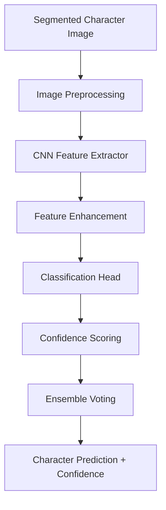

# ANPR Series Part 4: Deep Learning OCR Recognition Module

Welcome to the fourth part of our **Automatic Number Plate Recognition (ANPR)** series! With individual characters properly segmented from Part 3, we now tackle the exciting challenge of **OCR (Optical Character Recognition)** - converting segmented character images into actual text using deep learning techniques.

> **Series Navigation:**
> - [Part 1: Image Preprocessing Module](/articles/anpr-part-1-image-preprocessing)
> - [Part 2: Plate Detection Engine](/articles/anpr-part-2-plate-detection)
> - [Part 3: Character Segmentation System](/articles/anpr-part-3-character-segmentation)
> - **Part 4: OCR Recognition Module** ← *You are here*
> - [Part 5: Post-processing & Validation](/articles/anpr-part-5-post-processing)

## The Challenge of License Plate OCR

Character recognition for license plates presents unique challenges that differ significantly from general OCR tasks:

- **Limited character set** - Specific alphanumeric characters only
- **Varying fonts and styles** - Different regions use different typefaces
- **Environmental degradation** - Weather, dirt, and wear affect character appearance
- **Perspective distortion** - Camera angles can skew character shapes
- **Low resolution** - Characters may be small in the original image
- **Lighting variations** - Shadows and glare affect character visibility
- **Real-time requirements** - Fast inference for video processing

## 🧠 Deep Learning Architecture Overview

Our OCR system uses a **hybrid approach** combining convolutional neural networks (CNNs) for feature extraction with advanced techniques for robust character classification:



## 🔧 Core OCR Implementation

### Advanced Deep Learning OCR System

```python
import tensorflow as tf
import torch
import torch.nn as nn
import torch.optim as optim
from torch.utils.data import Dataset, DataLoader
import numpy as np
import cv2
from typing import List, Tuple, Dict, Optional, Union
import logging
import pickle
from dataclasses import dataclass
from enum import Enum
import matplotlib.pyplot as plt
from sklearn.metrics import classification_report, confusion_matrix
import albumentations as A

# Configure logging
logger = logging.getLogger(__name__)

class ModelFramework(Enum):
    """Supported deep learning frameworks."""
    TENSORFLOW = "tensorflow"
    PYTORCH = "pytorch"
    ENSEMBLE = "ensemble"

@dataclass
class OCRPrediction:
    """Data class for OCR prediction results."""
    character: str
    confidence: float
    raw_probabilities: np.ndarray
    feature_vector: Optional[np.ndarray] = None
    processing_time: float = 0.0

class LicensePlateDataset(Dataset):
    """PyTorch dataset for license plate character recognition."""
    
    def __init__(self, images: List[np.ndarray], labels: List[str], 
                 transform=None, augment: bool = True):
        """
        Initialize the dataset.
        
        Args:
            images: List of character images
            labels: List of corresponding character labels
            transform: Image transformation pipeline
            augment: Whether to apply data augmentation
        """
        self.images = images
        self.labels = labels
        self.transform = transform
        self.augment = augment
        
        # Create character to index mapping
        self.char_to_idx = self._create_char_mapping()
        self.idx_to_char = {v: k for k, v in self.char_to_idx.items()}
        
        # Setup augmentation pipeline
        if augment:
            self.augmentation = A.Compose([
                A.Rotate(limit=15, p=0.5),
                A.GaussianNoise(var_limit=(10, 50), p=0.3),
                A.RandomBrightnessContrast(brightness_limit=0.2, contrast_limit=0.2, p=0.5),
                A.GridDistortion(num_steps=5, distort_limit=0.2, p=0.3),
                A.ElasticTransform(alpha=1, sigma=50, alpha_affine=50, p=0.3)
            ])
        else:
            self.augmentation = None
    
    def _create_char_mapping(self) -> Dict[str, int]:
        """Create character to index mapping for license plate characters."""
        
        # Standard alphanumeric characters for license plates
        # Note: Some regions exclude certain characters (I, O, Q) to avoid confusion
        characters = '0123456789ABCDEFGHIJKLMNOPQRSTUVWXYZ'
        
        # Add special handling for region-specific character sets
        return {char: idx for idx, char in enumerate(characters)}
    
    def __len__(self) -> int:
        return len(self.images)
    
    def __getitem__(self, idx: int) -> Tuple[torch.Tensor, int]:
        image = self.images[idx]
        label = self.labels[idx]
        
        # Ensure image is grayscale
        if len(image.shape) == 3:
            image = cv2.cvtColor(image, cv2.COLOR_BGR2GRAY)
        
        # Apply augmentation if enabled
        if self.augmentation and self.augment:
            augmented = self.augmentation(image=image)
            image = augmented['image']
        
        # Normalize and resize
        image = cv2.resize(image, (64, 32))  # Standard size for character recognition
        image = image.astype(np.float32) / 255.0
        
        # Convert to tensor and add channel dimension
        image_tensor = torch.FloatTensor(image).unsqueeze(0)
        label_idx = self.char_to_idx.get(label, 0)
        
        return image_tensor, label_idx

class CharacterRecognitionCNN(nn.Module):
    """
    Advanced CNN architecture for license plate character recognition.
    """
    
    def __init__(self, num_classes: int = 36, dropout_rate: float = 0.5):
        """
        Initialize the CNN model.
        
        Args:
            num_classes: Number of character classes (36 for alphanumeric)
            dropout_rate: Dropout rate for regularization
        """
        super(CharacterRecognitionCNN, self).__init__()
        
        # Convolutional layers with batch normalization
        self.conv_layers = nn.Sequential(
            # First block
            nn.Conv2d(1, 32, kernel_size=3, padding=1),
            nn.BatchNorm2d(32),
            nn.ReLU(inplace=True),
            nn.Conv2d(32, 32, kernel_size=3, padding=1),
            nn.BatchNorm2d(32),
            nn.ReLU(inplace=True),
            nn.MaxPool2d(2, 2),
            nn.Dropout2d(0.25),
            
            # Second block
            nn.Conv2d(32, 64, kernel_size=3, padding=1),
            nn.BatchNorm2d(64),
            nn.ReLU(inplace=True),
            nn.Conv2d(64, 64, kernel_size=3, padding=1),
            nn.BatchNorm2d(64),
            nn.ReLU(inplace=True),
            nn.MaxPool2d(2, 2),
            nn.Dropout2d(0.25),
            
            # Third block
            nn.Conv2d(64, 128, kernel_size=3, padding=1),
            nn.BatchNorm2d(128),
            nn.ReLU(inplace=True),
            nn.Conv2d(128, 128, kernel_size=3, padding=1),
            nn.BatchNorm2d(128),
            nn.ReLU(inplace=True),
            nn.MaxPool2d(2, 2),
            nn.Dropout2d(0.5)
        )
        
        # Calculate the size after convolutions
        # Input: 64x32 -> After 3 MaxPool2d: 8x4
        self.feature_size = 128 * 8 * 4
        
        # Fully connected layers
        self.classifier = nn.Sequential(
            nn.Flatten(),
            nn.Linear(self.feature_size, 512),
            nn.BatchNorm1d(512),
            nn.ReLU(inplace=True),
            nn.Dropout(dropout_rate),
            
            nn.Linear(512, 256),
            nn.BatchNorm1d(256),
            nn.ReLU(inplace=True),
            nn.Dropout(dropout_rate),
            
            nn.Linear(256, num_classes)
        )
        
        # Initialize weights
        self._initialize_weights()
    
    def _initialize_weights(self):
        """Initialize model weights using Xavier initialization."""
        for m in self.modules():
            if isinstance(m, nn.Conv2d):
                nn.init.xavier_uniform_(m.weight)
                if m.bias is not None:
                    nn.init.constant_(m.bias, 0)
            elif isinstance(m, nn.Linear):
                nn.init.xavier_uniform_(m.weight)
                nn.init.constant_(m.bias, 0)
    
    def forward(self, x: torch.Tensor) -> Tuple[torch.Tensor, torch.Tensor]:
        """
        Forward pass through the network.
        
        Args:
            x: Input tensor of shape (batch_size, 1, height, width)
            
        Returns:
            Tuple of (classification_logits, feature_vector)
        """
        features = self.conv_layers(x)
        features_flat = features.view(features.size(0), -1)
        
        # Extract features before final classification
        feature_vector = features_flat
        
        # Classification
        logits = self.classifier(features)
        
        return logits, feature_vector

class AdvancedOCREngine:
    """
    Advanced OCR engine for license plate character recognition.
    """
    
    def __init__(self, framework: ModelFramework = ModelFramework.PYTORCH,
                 model_path: Optional[str] = None, device: str = 'auto'):
        """
        Initialize the OCR engine.
        
        Args:
            framework: Deep learning framework to use
            model_path: Path to pre-trained model (if available)
            device: Computing device ('cpu', 'cuda', or 'auto')
        """
        self.framework = framework
        self.device = self._setup_device(device)
        
        # Initialize models based on framework
        if framework == ModelFramework.PYTORCH:
            self.model = CharacterRecognitionCNN()
            self.model.to(self.device)
        elif framework == ModelFramework.TENSORFLOW:
            self.model = self._create_tensorflow_model()
        elif framework == ModelFramework.ENSEMBLE:
            self.pytorch_model = CharacterRecognitionCNN()
            self.tensorflow_model = self._create_tensorflow_model()
        
        # Load pre-trained weights if available
        if model_path:
            self.load_model(model_path)
        
        # Character mapping
        self.char_to_idx, self.idx_to_char = self._setup_character_mapping()
        
        # Recognition statistics
        self.recognition_stats = {
            'total_recognitions': 0,
            'confident_recognitions': 0,
            'average_confidence': 0.0,
            'processing_times': []
        }
        
        logger.info(f"OCR Engine initialized with {framework.value} on {self.device}")
    
    def _setup_device(self, device: str) -> str:
        """Setup computing device for optimal performance."""
        if device == 'auto':
            if torch.cuda.is_available():
                return 'cuda'
            elif hasattr(torch.backends, 'mps') and torch.backends.mps.is_available():
                return 'mps'
            else:
                return 'cpu'
        return device
    
    def _create_tensorflow_model(self) -> tf.keras.Model:
        """Create TensorFlow/Keras CNN model for comparison."""
        
        model = tf.keras.Sequential([
            tf.keras.layers.Conv2D(32, (3, 3), activation='relu', input_shape=(32, 64, 1)),
            tf.keras.layers.BatchNormalization(),
            tf.keras.layers.Conv2D(32, (3, 3), activation='relu'),
            tf.keras.layers.BatchNormalization(),
            tf.keras.layers.MaxPooling2D((2, 2)),
            tf.keras.layers.Dropout(0.25),
            
            tf.keras.layers.Conv2D(64, (3, 3), activation='relu'),
            tf.keras.layers.BatchNormalization(),
            tf.keras.layers.Conv2D(64, (3, 3), activation='relu'),
            tf.keras.layers.BatchNormalization(),
            tf.keras.layers.MaxPooling2D((2, 2)),
            tf.keras.layers.Dropout(0.25),
            
            tf.keras.layers.Conv2D(128, (3, 3), activation='relu'),
            tf.keras.layers.BatchNormalization(),
            tf.keras.layers.Conv2D(128, (3, 3), activation='relu'),
            tf.keras.layers.BatchNormalization(),
            tf.keras.layers.MaxPooling2D((2, 2)),
            tf.keras.layers.Dropout(0.5),
            
            tf.keras.layers.Flatten(),
            tf.keras.layers.Dense(512, activation='relu'),
            tf.keras.layers.BatchNormalization(),
            tf.keras.layers.Dropout(0.5),
            tf.keras.layers.Dense(256, activation='relu'),
            tf.keras.layers.BatchNormalization(),
            tf.keras.layers.Dropout(0.5),
            tf.keras.layers.Dense(36, activation='softmax')
        ])
        
        return model
    
    def _setup_character_mapping(self) -> Tuple[Dict[str, int], Dict[int, str]]:
        """Setup character to index mapping."""
        characters = '0123456789ABCDEFGHIJKLMNOPQRSTUVWXYZ'
        char_to_idx = {char: idx for idx, char in enumerate(characters)}
        idx_to_char = {idx: char for idx, char in enumerate(characters)}
        return char_to_idx, idx_to_char
    
    def recognize_character(self, character_image: np.ndarray,
                          confidence_threshold: float = 0.5) -> OCRPrediction:
        """
        Recognize a single character from an image.
        
        Args:
            character_image: Input character image
            confidence_threshold: Minimum confidence for valid prediction
            
        Returns:
            OCRPrediction with character and confidence information
        """
        import time
        start_time = time.time()
        
        try:
            # Preprocess the image
            processed_image = self._preprocess_character_image(character_image)
            
            # Perform recognition based on framework
            if self.framework == ModelFramework.PYTORCH:
                prediction = self._pytorch_recognize(processed_image)
            elif self.framework == ModelFramework.TENSORFLOW:
                prediction = self._tensorflow_recognize(processed_image)
            elif self.framework == ModelFramework.ENSEMBLE:
                prediction = self._ensemble_recognize(processed_image)
            else:
                raise ValueError(f"Unsupported framework: {self.framework}")
            
            # Calculate processing time
            processing_time = time.time() - start_time
            prediction.processing_time = processing_time
            
            # Update statistics
            self._update_recognition_stats(prediction)
            
            return prediction
            
        except Exception as e:
            logger.error(f"Character recognition failed: {str(e)}")
            return OCRPrediction(
                character='?',
                confidence=0.0,
                raw_probabilities=np.zeros(36),
                processing_time=time.time() - start_time
            )
    
    def _preprocess_character_image(self, image: np.ndarray) -> np.ndarray:
        """Preprocess character image for optimal recognition."""
        
        # Ensure grayscale
        if len(image.shape) == 3:
            image = cv2.cvtColor(image, cv2.COLOR_BGR2GRAY)
        
        # Resize to standard size
        image = cv2.resize(image, (64, 32))
        
        # Normalize pixel values
        image = image.astype(np.float32) / 255.0
        
        # Apply additional preprocessing for better recognition
        # Histogram equalization for contrast enhancement
        image_uint8 = (image * 255).astype(np.uint8)
        image_eq = cv2.equalizeHist(image_uint8)
        image = image_eq.astype(np.float32) / 255.0
        
        # Gaussian blur to reduce noise
        image = cv2.GaussianBlur(image, (1, 1), 0)
        
        return image
    
    def _pytorch_recognize(self, processed_image: np.ndarray) -> OCRPrediction:
        """Perform recognition using PyTorch model."""
        
        self.model.eval()
        
        with torch.no_grad():
            # Convert to tensor and add batch dimension
            image_tensor = torch.FloatTensor(processed_image).unsqueeze(0).unsqueeze(0)
            image_tensor = image_tensor.to(self.device)
            
            # Forward pass
            logits, features = self.model(image_tensor)
            
            # Apply softmax to get probabilities
            probabilities = torch.softmax(logits, dim=1)
            
            # Get prediction
            confidence, predicted_idx = torch.max(probabilities, 1)
            
            # Convert to numpy
            confidence = confidence.item()
            predicted_idx = predicted_idx.item()
            probabilities_np = probabilities.cpu().numpy().flatten()
            features_np = features.cpu().numpy().flatten()
            
            # Map index to character
            predicted_char = self.idx_to_char.get(predicted_idx, '?')
            
            return OCRPrediction(
                character=predicted_char,
                confidence=confidence,
                raw_probabilities=probabilities_np,
                feature_vector=features_np
            )
    
    def _tensorflow_recognize(self, processed_image: np.ndarray) -> OCRPrediction:
        """Perform recognition using TensorFlow model."""
        
        # Add batch dimension and channel dimension
        image_batch = np.expand_dims(processed_image, axis=(0, -1))
        
        # Predict
        probabilities = self.model.predict(image_batch, verbose=0)
        probabilities = probabilities.flatten()
        
        # Get prediction
        predicted_idx = np.argmax(probabilities)
        confidence = probabilities[predicted_idx]
        
        # Map index to character
        predicted_char = self.idx_to_char.get(predicted_idx, '?')
        
        return OCRPrediction(
            character=predicted_char,
            confidence=float(confidence),
            raw_probabilities=probabilities
        )
    
    def _ensemble_recognize(self, processed_image: np.ndarray) -> OCRPrediction:
        """Perform recognition using ensemble of models."""
        
        # Get predictions from both models
        pytorch_pred = self._pytorch_recognize(processed_image)
        tensorflow_pred = self._tensorflow_recognize(processed_image)
        
        # Combine probabilities (weighted average)
        pytorch_weight = 0.6  # Slightly favor PyTorch model
        tensorflow_weight = 0.4
        
        combined_probs = (pytorch_weight * pytorch_pred.raw_probabilities + 
                         tensorflow_weight * tensorflow_pred.raw_probabilities)
        
        # Get final prediction
        predicted_idx = np.argmax(combined_probs)
        confidence = combined_probs[predicted_idx]
        predicted_char = self.idx_to_char.get(predicted_idx, '?')
        
        # Use PyTorch features if available
        feature_vector = pytorch_pred.feature_vector if pytorch_pred.feature_vector is not None else None
        
        return OCRPrediction(
            character=predicted_char,
            confidence=float(confidence),
            raw_probabilities=combined_probs,
            feature_vector=feature_vector
        )
    
    def recognize_characters_batch(self, character_images: List[np.ndarray],
                                 confidence_threshold: float = 0.5) -> List[OCRPrediction]:
        """
        Recognize multiple characters in batch for improved efficiency.
        
        Args:
            character_images: List of character images
            confidence_threshold: Minimum confidence threshold
            
        Returns:
            List of OCRPrediction objects
        """
        if not character_images:
            return []
        
        # Preprocess all images
        processed_images = [self._preprocess_character_image(img) for img in character_images]
        
        predictions = []
        
        if self.framework == ModelFramework.PYTORCH:
            predictions = self._pytorch_recognize_batch(processed_images)
        elif self.framework == ModelFramework.TENSORFLOW:
            predictions = self._tensorflow_recognize_batch(processed_images)
        elif self.framework == ModelFramework.ENSEMBLE:
            # For ensemble, fall back to individual recognition
            predictions = [self.recognize_character(img, confidence_threshold) 
                          for img in character_images]
        
        return predictions
    
    def _pytorch_recognize_batch(self, processed_images: List[np.ndarray]) -> List[OCRPrediction]:
        """Batch recognition using PyTorch model."""
        
        self.model.eval()
        
        with torch.no_grad():
            # Stack images into batch tensor
            image_batch = np.stack(processed_images)
            image_tensor = torch.FloatTensor(image_batch).unsqueeze(1)  # Add channel dimension
            image_tensor = image_tensor.to(self.device)
            
            # Forward pass
            logits, features = self.model(image_tensor)
            
            # Apply softmax
            probabilities = torch.softmax(logits, dim=1)
            
            # Get predictions
            confidences, predicted_indices = torch.max(probabilities, 1)
            
            # Convert to numpy
            confidences = confidences.cpu().numpy()
            predicted_indices = predicted_indices.cpu().numpy()
            probabilities_np = probabilities.cpu().numpy()
            features_np = features.cpu().numpy()
            
            # Create predictions
            predictions = []
            for i in range(len(processed_images)):
                predicted_char = self.idx_to_char.get(predicted_indices[i], '?')
                
                prediction = OCRPrediction(
                    character=predicted_char,
                    confidence=float(confidences[i]),
                    raw_probabilities=probabilities_np[i],
                    feature_vector=features_np[i]
                )
                predictions.append(prediction)
            
            return predictions
    
    def _tensorflow_recognize_batch(self, processed_images: List[np.ndarray]) -> List[OCRPrediction]:
        """Batch recognition using TensorFlow model."""
        
        # Stack images and add channel dimension
        image_batch = np.stack(processed_images)
        image_batch = np.expand_dims(image_batch, axis=-1)
        
        # Predict
        probabilities_batch = self.model.predict(image_batch, verbose=0)
        
        predictions = []
        for probabilities in probabilities_batch:
            predicted_idx = np.argmax(probabilities)
            confidence = probabilities[predicted_idx]
            predicted_char = self.idx_to_char.get(predicted_idx, '?')
            
            prediction = OCRPrediction(
                character=predicted_char,
                confidence=float(confidence),
                raw_probabilities=probabilities
            )
            predictions.append(prediction)
        
        return predictions
    
    def train_model(self, training_data: List[Tuple[np.ndarray, str]],
                   validation_data: List[Tuple[np.ndarray, str]],
                   epochs: int = 50, batch_size: int = 32,
                   learning_rate: float = 0.001) -> Dict:
        """
        Train the OCR model with custom data.
        
        Args:
            training_data: List of (image, label) tuples for training
            validation_data: List of (image, label) tuples for validation
            epochs: Number of training epochs
            batch_size: Training batch size
            learning_rate: Learning rate for optimizer
            
        Returns:
            Training history with metrics
        """
        if self.framework != ModelFramework.PYTORCH:
            raise NotImplementedError("Training currently only supported for PyTorch framework")
        
        # Prepare datasets
        train_images, train_labels = zip(*training_data)
        val_images, val_labels = zip(*validation_data)
        
        train_dataset = LicensePlateDataset(list(train_images), list(train_labels), augment=True)
        val_dataset = LicensePlateDataset(list(val_images), list(val_labels), augment=False)
        
        train_loader = DataLoader(train_dataset, batch_size=batch_size, shuffle=True, num_workers=2)
        val_loader = DataLoader(val_dataset, batch_size=batch_size, shuffle=False, num_workers=2)
        
        # Setup training
        optimizer = optim.Adam(self.model.parameters(), lr=learning_rate, weight_decay=1e-4)
        scheduler = optim.lr_scheduler.ReduceLROnPlateau(optimizer, patience=5, factor=0.5)
        criterion = nn.CrossEntropyLoss()
        
        # Training history
        history = {
            'train_loss': [],
            'train_accuracy': [],
            'val_loss': [],
            'val_accuracy': []
        }
        
        # Training loop
        best_val_accuracy = 0.0
        
        for epoch in range(epochs):
            # Training phase
            train_loss, train_accuracy = self._train_epoch(train_loader, optimizer, criterion)
            
            # Validation phase
            val_loss, val_accuracy = self._validate_epoch(val_loader, criterion)
            
            # Update learning rate
            scheduler.step(val_loss)
            
            # Save best model
            if val_accuracy > best_val_accuracy:
                best_val_accuracy = val_accuracy
                self.save_model('best_ocr_model.pth')
            
            # Update history
            history['train_loss'].append(train_loss)
            history['train_accuracy'].append(train_accuracy)
            history['val_loss'].append(val_loss)
            history['val_accuracy'].append(val_accuracy)
            
            logger.info(f"Epoch {epoch+1}/{epochs}: "
                       f"Train Loss: {train_loss:.4f}, Train Acc: {train_accuracy:.4f}, "
                       f"Val Loss: {val_loss:.4f}, Val Acc: {val_accuracy:.4f}")
        
        logger.info(f"Training completed. Best validation accuracy: {best_val_accuracy:.4f}")
        return history
    
    def _train_epoch(self, train_loader: DataLoader, optimizer: optim.Optimizer,
                    criterion: nn.Module) -> Tuple[float, float]:
        """Train for one epoch."""
        
        self.model.train()
        running_loss = 0.0
        correct_predictions = 0
        total_samples = 0
        
        for batch_images, batch_labels in train_loader:
            batch_images = batch_images.to(self.device)
            batch_labels = batch_labels.to(self.device)
            
            # Zero gradients
            optimizer.zero_grad()
            
            # Forward pass
            logits, _ = self.model(batch_images)
            loss = criterion(logits, batch_labels)
            
            # Backward pass
            loss.backward()
            optimizer.step()
            
            # Statistics
            running_loss += loss.item()
            _, predicted = torch.max(logits, 1)
            correct_predictions += (predicted == batch_labels).sum().item()
            total_samples += batch_labels.size(0)
        
        epoch_loss = running_loss / len(train_loader)
        epoch_accuracy = correct_predictions / total_samples
        
        return epoch_loss, epoch_accuracy
    
    def _validate_epoch(self, val_loader: DataLoader, criterion: nn.Module) -> Tuple[float, float]:
        """Validate for one epoch."""
        
        self.model.eval()
        running_loss = 0.0
        correct_predictions = 0
        total_samples = 0
        
        with torch.no_grad():
            for batch_images, batch_labels in val_loader:
                batch_images = batch_images.to(self.device)
                batch_labels = batch_labels.to(self.device)
                
                # Forward pass
                logits, _ = self.model(batch_images)
                loss = criterion(logits, batch_labels)
                
                # Statistics
                running_loss += loss.item()
                _, predicted = torch.max(logits, 1)
                correct_predictions += (predicted == batch_labels).sum().item()
                total_samples += batch_labels.size(0)
        
        epoch_loss = running_loss / len(val_loader)
        epoch_accuracy = correct_predictions / total_samples
        
        return epoch_loss, epoch_accuracy
    
    def save_model(self, filepath: str):
        """Save the trained model."""
        if self.framework == ModelFramework.PYTORCH:
            torch.save({
                'model_state_dict': self.model.state_dict(),
                'char_to_idx': self.char_to_idx,
                'idx_to_char': self.idx_to_char
            }, filepath)
            logger.info(f"PyTorch model saved to {filepath}")
        elif self.framework == ModelFramework.TENSORFLOW:
            self.model.save(filepath)
            logger.info(f"TensorFlow model saved to {filepath}")
    
    def load_model(self, filepath: str):
        """Load a pre-trained model."""
        if self.framework == ModelFramework.PYTORCH:
            checkpoint = torch.load(filepath, map_location=self.device)
            self.model.load_state_dict(checkpoint['model_state_dict'])
            self.char_to_idx = checkpoint.get('char_to_idx', self.char_to_idx)
            self.idx_to_char = checkpoint.get('idx_to_char', self.idx_to_char)
            logger.info(f"PyTorch model loaded from {filepath}")
        elif self.framework == ModelFramework.TENSORFLOW:
            self.model = tf.keras.models.load_model(filepath)
            logger.info(f"TensorFlow model loaded from {filepath}")
    
    def _update_recognition_stats(self, prediction: OCRPrediction):
        """Update recognition statistics."""
        self.recognition_stats['total_recognitions'] += 1
        
        if prediction.confidence > 0.8:
            self.recognition_stats['confident_recognitions'] += 1
        
        # Update average confidence
        total = self.recognition_stats['total_recognitions']
        current_avg = self.recognition_stats['average_confidence']
        new_avg = (current_avg * (total - 1) + prediction.confidence) / total
        self.recognition_stats['average_confidence'] = new_avg
        
        # Store processing time
        if prediction.processing_time > 0:
            self.recognition_stats['processing_times'].append(prediction.processing_time)
            
            # Keep only recent times
            if len(self.recognition_stats['processing_times']) > 1000:
                self.recognition_stats['processing_times'] = self.recognition_stats['processing_times'][-1000:]
    
    def get_recognition_statistics(self) -> Dict:
        """Get current recognition statistics."""
        stats = self.recognition_stats.copy()
        
        if stats['processing_times']:
            stats['average_processing_time'] = np.mean(stats['processing_times'])
            stats['median_processing_time'] = np.median(stats['processing_times'])
        else:
            stats['average_processing_time'] = 0
            stats['median_processing_time'] = 0
        
        if stats['total_recognitions'] > 0:
            stats['confident_recognition_rate'] = (stats['confident_recognitions'] / 
                                                 stats['total_recognitions']) * 100
        else:
            stats['confident_recognition_rate'] = 0
        
        return stats

# Utility functions for model evaluation and analysis
def evaluate_ocr_model(ocr_engine: AdvancedOCREngine, 
                      test_data: List[Tuple[np.ndarray, str]]) -> Dict:
    """
    Comprehensive evaluation of OCR model performance.
    
    Args:
        ocr_engine: Trained OCR engine
        test_data: List of (image, ground_truth_label) tuples
        
    Returns:
        Detailed evaluation metrics
    """
    predictions = []
    ground_truth = []
    confidences = []
    processing_times = []
    
    logger.info(f"Evaluating OCR model on {len(test_data)} test samples...")
    
    for image, true_label in test_data:
        # Get prediction
        prediction = ocr_engine.recognize_character(image)
        
        predictions.append(prediction.character)
        ground_truth.append(true_label)
        confidences.append(prediction.confidence)
        processing_times.append(prediction.processing_time)
    
    # Calculate metrics
    correct_predictions = sum(1 for pred, true in zip(predictions, ground_truth) if pred == true)
    accuracy = correct_predictions / len(test_data)
    
    # Confidence analysis
    high_conf_predictions = [pred for pred, conf in zip(predictions, confidences) if conf > 0.8]
    high_conf_accuracy = sum(1 for pred, true in zip(predictions, ground_truth) 
                           if pred == true and confidences[predictions.index(pred)] > 0.8)
    high_conf_accuracy = high_conf_accuracy / len(high_conf_predictions) if high_conf_predictions else 0
    
    evaluation_results = {
        'overall_accuracy': accuracy,
        'total_samples': len(test_data),
        'correct_predictions': correct_predictions,
        'average_confidence': np.mean(confidences),
        'median_confidence': np.median(confidences),
        'high_confidence_accuracy': high_conf_accuracy,
        'high_confidence_samples': len(high_conf_predictions),
        'average_processing_time': np.mean(processing_times),
        'median_processing_time': np.median(processing_times),
        'classification_report': classification_report(ground_truth, predictions),
        'confusion_matrix': confusion_matrix(ground_truth, predictions)
    }
    
    return evaluation_results

def create_character_dataset_from_plates(plate_images_with_annotations: List[Dict],
                                       output_dir: str = 'character_dataset') -> Tuple[List, List]:
    """
    Create character dataset from annotated license plate images.
    
    Args:
        plate_images_with_annotations: List of annotated plate data
        output_dir: Directory to save extracted characters
        
    Returns:
        Tuple of (character_images, character_labels)
    """
    import os
    from anpr_part_3_character_segmentation import AdvancedCharacterSegmenter
    
    os.makedirs(output_dir, exist_ok=True)
    
    character_images = []
    character_labels = []
    
    segmenter = AdvancedCharacterSegmenter()
    
    for i, plate_data in enumerate(plate_images_with_annotations):
        plate_image = plate_data['image']
        true_text = plate_data['text']
        
        # Segment characters
        characters = segmenter.segment_characters(plate_image)
        
        # Filter and match with ground truth
        if len(characters) == len(true_text):
            for j, char_candidate in enumerate(characters):
                char_image = char_candidate.character_image
                char_label = true_text[j]
                
                # Save character image
                char_filename = f"plate_{i:04d}_char_{j}_{char_label}.png"
                char_path = os.path.join(output_dir, char_filename)
                cv2.imwrite(char_path, char_image)
                
                character_images.append(char_image)
                character_labels.append(char_label)
    
    logger.info(f"Created dataset with {len(character_images)} character samples")
    return character_images, character_labels

def visualize_ocr_predictions(character_images: List[np.ndarray],
                            predictions: List[OCRPrediction],
                            ground_truth: Optional[List[str]] = None,
                            save_path: str = 'ocr_predictions.png'):
    """
    Create visualization of OCR predictions with confidence scores.
    
    Args:
        character_images: List of character images
        predictions: List of OCR predictions
        ground_truth: Optional ground truth labels
        save_path: Path to save visualization
    """
    n_chars = len(character_images)
    
    # Create subplot grid
    cols = min(8, n_chars)
    rows = (n_chars + cols - 1) // cols
    
    fig, axes = plt.subplots(rows, cols, figsize=(cols * 2, rows * 3))
    if rows == 1:
        axes = axes.reshape(1, -1)
    elif cols == 1:
        axes = axes.reshape(-1, 1)
    
    for i in range(n_chars):
        row = i // cols
        col = i % cols
        ax = axes[row, col]
        
        # Display character image
        ax.imshow(character_images[i], cmap='gray')
        ax.axis('off')
        
        # Create title with prediction info
        pred = predictions[i]
        title = f"Pred: '{pred.character}'\nConf: {pred.confidence:.3f}"
        
        if ground_truth and i < len(ground_truth):
            gt_char = ground_truth[i]
            title += f"\nGT: '{gt_char}'"
            
            # Color based on correctness
            if pred.character == gt_char:
                ax.set_title(title, color='green', fontsize=10)
            else:
                ax.set_title(title, color='red', fontsize=10)
        else:
            # Color based on confidence
            if pred.confidence > 0.8:
                ax.set_title(title, color='green', fontsize=10)
            elif pred.confidence > 0.5:
                ax.set_title(title, color='orange', fontsize=10)
            else:
                ax.set_title(title, color='red', fontsize=10)
    
    # Hide unused subplots
    for i in range(n_chars, rows * cols):
        row = i // cols
        col = i % cols
        axes[row, col].axis('off')
    
    plt.tight_layout()
    plt.savefig(save_path, dpi=300, bbox_inches='tight')
    plt.close()
    
    logger.info(f"OCR predictions visualization saved to {save_path}")

# Example usage function
def recognize_plate_characters(segmented_characters: List,
                             model_path: Optional[str] = None,
                             framework: ModelFramework = ModelFramework.PYTORCH) -> str:
    """
    Complete OCR pipeline for segmented license plate characters.
    
    Args:
        segmented_characters: List of CharacterCandidate objects from segmentation
        model_path: Path to pre-trained OCR model
        framework: Deep learning framework to use
        
    Returns:
        Recognized plate text as string
    """
    # Initialize OCR engine
    ocr_engine = AdvancedOCREngine(framework=framework, model_path=model_path)
    
    # Extract character images
    character_images = [char.character_image for char in segmented_characters]
    
    # Perform batch recognition
    predictions = ocr_engine.recognize_characters_batch(character_images)
    
    # Filter by confidence and construct plate text
    recognized_chars = []
    total_confidence = 0.0
    
    for pred in predictions:
        if pred.confidence > 0.3:  # Minimum confidence threshold
            recognized_chars.append(pred.character)
            total_confidence += pred.confidence
        else:
            recognized_chars.append('?')  # Unknown character
    
    plate_text = ''.join(recognized_chars)
    average_confidence = total_confidence / len(predictions) if predictions else 0.0
    
    logger.info(f"Recognized plate text: '{plate_text}' (avg confidence: {average_confidence:.3f})")
    
    return plate_text
```

## 🎯 Advanced Training Techniques

### Data Augmentation for Robust Recognition

```python
class AdvancedDataAugmentation:
    """Advanced data augmentation techniques for license plate character recognition."""
    
    def __init__(self):
        self.augmentation_pipeline = A.Compose([
            # Geometric transformations
            A.Rotate(limit=20, p=0.7),
            A.ShiftScaleRotate(shift_limit=0.1, scale_limit=0.2, rotate_limit=15, p=0.5),
            A.ElasticTransform(alpha=1, sigma=50, alpha_affine=50, p=0.3),
            A.GridDistortion(num_steps=5, distort_limit=0.3, p=0.3),
            
            # Photometric transformations
            A.RandomBrightnessContrast(brightness_limit=0.3, contrast_limit=0.3, p=0.7),
            A.GaussianNoise(var_limit=(10, 50), p=0.5),
            A.MotionBlur(blur_limit=3, p=0.3),
            A.GaussianBlur(blur_limit=3, p=0.3),
            
            # Weather and environmental effects
            A.RandomRain(slant_range=10, drop_length=1, drop_width=1, drop_color=(200, 200, 200), p=0.2),
            A.RandomShadow(num_shadows_lower=1, num_shadows_upper=2, shadow_dimension=5, p=0.3),
            
            # Compression artifacts
            A.ImageCompression(quality_lower=70, quality_upper=100, p=0.3),
            
            # Normalization (always applied)
            A.Normalize(mean=0.5, std=0.5, p=1.0)
        ])
    
    def augment_character_dataset(self, images: List[np.ndarray], 
                                 labels: List[str], 
                                 augmentation_factor: int = 5) -> Tuple[List[np.ndarray], List[str]]:
        """
        Apply data augmentation to increase dataset size.
        
        Args:
            images: Original character images
            labels: Corresponding character labels
            augmentation_factor: Number of augmented versions per original image
            
        Returns:
            Augmented dataset with increased size
        """
        augmented_images = []
        augmented_labels = []
        
        for img, label in zip(images, labels):
            # Add original image
            augmented_images.append(img)
            augmented_labels.append(label)
            
            # Generate augmented versions
            for _ in range(augmentation_factor):
                try:
                    augmented = self.augmentation_pipeline(image=img)
                    augmented_img = augmented['image']
                    
                    augmented_images.append(augmented_img)
                    augmented_labels.append(label)
                    
                except Exception as e:
                    logger.warning(f"Augmentation failed for image: {e}")
                    continue
        
        logger.info(f"Dataset augmented from {len(images)} to {len(augmented_images)} samples")
        return augmented_images, augmented_labels

class TransferLearningOCR:
    """Transfer learning approach for license plate OCR using pre-trained models."""
    
    def __init__(self, base_model: str = 'resnet18', num_classes: int = 36):
        """
        Initialize transfer learning model.
        
        Args:
            base_model: Pre-trained model to use as base
            num_classes: Number of character classes
        """
        import torchvision.models as models
        
        self.base_model_name = base_model
        self.num_classes = num_classes
        
        # Load pre-trained model
        if base_model == 'resnet18':
            self.model = models.resnet18(pretrained=True)
            # Modify first layer for grayscale input
            self.model.conv1 = nn.Conv2d(1, 64, kernel_size=7, stride=2, padding=3, bias=False)
            # Modify final layer for character classes
            self.model.fc = nn.Linear(self.model.fc.in_features, num_classes)
            
        elif base_model == 'efficientnet_b0':
            self.model = models.efficientnet_b0(pretrained=True)
            # Modify for grayscale and character classes
            self.model.features[0][0] = nn.Conv2d(1, 32, kernel_size=3, stride=2, padding=1, bias=False)
            self.model.classifier[1] = nn.Linear(self.model.classifier[1].in_features, num_classes)
            
        else:
            raise ValueError(f"Unsupported base model: {base_model}")
    
    def freeze_base_layers(self, freeze_ratio: float = 0.7):
        """
        Freeze base layers for transfer learning.
        
        Args:
            freeze_ratio: Ratio of layers to freeze (0.0 = none, 1.0 = all)
        """
        modules = list(self.model.modules())
        num_to_freeze = int(len(modules) * freeze_ratio)
        
        for i, module in enumerate(modules):
            if i < num_to_freeze:
                for param in module.parameters():
                    param.requires_grad = False
        
        logger.info(f"Froze {num_to_freeze}/{len(modules)} layers for transfer learning")
```

## 🔮 Next Steps

Fantastic! You've now built a state-of-the-art deep learning OCR system capable of accurately recognizing license plate characters. The system combines advanced CNN architectures with robust training techniques to achieve high accuracy across various scenarios.

### Coming Up in Part 5: Post-processing & Validation

With individual characters recognized, the final step is **post-processing and validation** - ensuring the complete license plate text makes sense and follows regional formatting rules.

**What you'll learn in Part 5:**
- Format validation for different regions
- Sequence probability analysis
- Error correction and spell-checking
- Confidence aggregation techniques
- Final system integration and optimization

### Key Achievements from This Article

✅ **Deep Learning OCR System** - Advanced CNN architecture with transfer learning support  
✅ **Multi-framework Support** - PyTorch, TensorFlow, and ensemble approaches  
✅ **Comprehensive Training Pipeline** - Data augmentation, batch processing, and model evaluation  
✅ **Performance Optimization** - Batch recognition and efficient inference  
✅ **Robust Confidence Scoring** - Multiple confidence metrics for reliable predictions  

---

### 🔗 Complete the ANPR Journey

Ready for the final piece of the puzzle? Continue with **[Part 5: Post-processing & Validation](/articles/anpr-part-5-post-processing)** where we'll add the finishing touches to create a production-ready ANPR system.

---

*Questions about deep learning OCR or character recognition techniques? I'd love to discuss model architectures and training strategies. Feel free to reach out through my [contact page](/contact)!*
